# Sneaker Collector's Assistant - Architecture Diagrams

## System Architecture (High-Level)

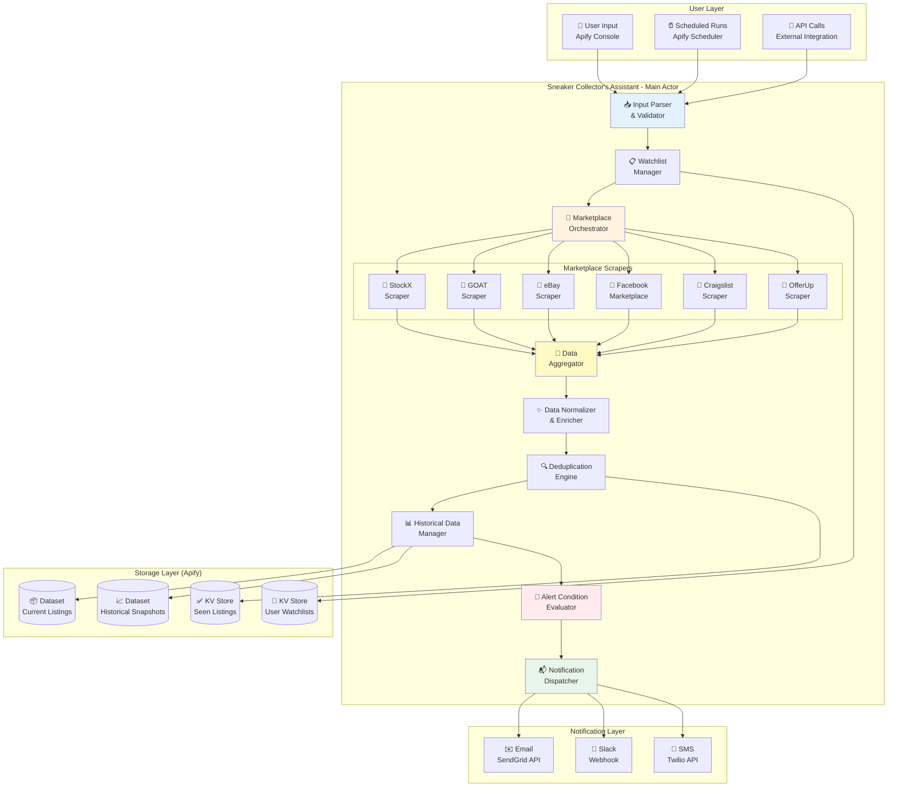

---

## Data Flow Diagram

```mermaid
flowchart TB
    Start([⏰ Scheduled Run Starts]) --> LoadInput[📥 Load User Input<br/>from Apify Console]
    LoadInput --> LoadWatchlist[📋 Load Watchlist<br/>from KV Store]
    LoadWatchlist --> ValidateInput{✅ Valid Input?}

    ValidateInput -->|No| ErrorOut[❌ Log Error<br/>& Exit]
    ValidateInput -->|Yes| ProcessWatchlist[🔄 Process Each<br/>Watchlist Item]

    ProcessWatchlist --> GenerateQueries[🔍 Generate Search<br/>Queries & Variants]
    GenerateQueries --> ParallelScrape[⚡ Launch 6 Parallel<br/>Platform Scrapers]

    ParallelScrape --> StockX[🏪 StockX<br/>Sub-Actor]
    ParallelScrape --> GOAT[🏪 GOAT<br/>Sub-Actor]
    ParallelScrape --> eBay[🏪 eBay<br/>Sub-Actor]
    ParallelScrape --> Facebook[🏪 Facebook<br/>Sub-Actor]
    ParallelScrape --> Craigslist[🏪 Craigslist<br/>Sub-Actor]
    ParallelScrape --> OfferUp[🏪 OfferUp<br/>Sub-Actor]

    StockX --> Aggregate
    GOAT --> Aggregate
    eBay --> Aggregate
    Facebook --> Aggregate
    Craigslist --> Aggregate
    OfferUp --> Aggregate

    Aggregate[🔄 Aggregate All<br/>Results] --> Normalize[✨ Normalize Data<br/>Size, Price, SKU]
    Normalize --> Enrich[🎨 Enrich Data<br/>Colorway, Brand]

    Enrich --> Dedupe[🔍 Check Duplicates<br/>Against Seen Listings]
    Dedupe --> CheckSeen{Already Seen?}

    CheckSeen -->|Yes| Skip[⏭️ Skip Listing]
    CheckSeen -->|No| NewListing[✨ New Listing Found]

    NewListing --> MarkSeen[✅ Mark as Seen<br/>in KV Store]
    MarkSeen --> SaveCurrent[💾 Save to<br/>Current Listings Dataset]

    SaveCurrent --> CheckHistorical{📊 24h Since Last<br/>Snapshot?}
    CheckHistorical -->|Yes| SaveHistorical[💾 Save to<br/>Historical Dataset]
    CheckHistorical -->|No| SkipHistorical[⏭️ Skip Snapshot]

    SaveHistorical --> EvaluateAlert
    SkipHistorical --> EvaluateAlert

    EvaluateAlert[🚨 Evaluate Alert<br/>Conditions] --> CheckConditions{🎯 Matches Watchlist<br/>Conditions?}

    CheckConditions -->|No| NoAlert[⏭️ No Alert]
    CheckConditions -->|Yes| FlagForAlert[🔔 Flag for Alert]

    FlagForAlert --> QueueAlert[📋 Add to Alert Queue]
    QueueAlert --> AllProcessed{All Listings<br/>Processed?}

    NoAlert --> AllProcessed
    Skip --> AllProcessed

    AllProcessed -->|No| ProcessWatchlist
    AllProcessed -->|Yes| GroupAlerts[👥 Group Alerts<br/>by User]

    GroupAlerts --> CheckFreq{📬 Check Notification<br/>Frequency}

    CheckFreq -->|Immediate| SendImmediate[✉️ Send Individual<br/>Email per Listing]
    CheckFreq -->|Hourly Digest| SendDigest[📦 Send Hourly<br/>Digest Email]
    CheckFreq -->|Daily| QueueDaily[⏰ Queue for Daily<br/>Summary]

    SendImmediate --> CheckSlack{💬 Slack Enabled?}
    SendDigest --> CheckSlack
    QueueDaily --> CheckSlack

    CheckSlack -->|Yes| SendSlack[💬 Send Slack<br/>Notification]
    CheckSlack -->|No| CheckSMS

    SendSlack --> CheckSMS{📱 SMS Enabled?}
    CheckSMS -->|Yes| SendSMS[📱 Send SMS<br/>via Twilio]
    CheckSMS -->|No| LogMetrics

    SendSMS --> LogMetrics[📊 Log Run Metrics<br/>& Statistics]
    LogMetrics --> OutputResults[📤 Push Results to<br/>Actor Output]
    OutputResults --> Complete([✅ Run Complete])

    ErrorOut --> Complete

    style Start fill:#4CAF50,color:#fff
    style Complete fill:#4CAF50,color:#fff
    style ErrorOut fill:#F44336,color:#fff
    style CheckConditions fill:#FFC107
    style FlagForAlert fill:#FF5722,color:#fff
    style SendImmediate fill:#2196F3,color:#fff
    style SendDigest fill:#2196F3,color:#fff
    style SendSlack fill:#9C27B0,color:#fff
    style SendSMS fill:#E91E63,color:#fff
```

---

## Marketplace Integration Flow

```mermaid
sequenceDiagram
    participant User as 👤 User
    participant Actor as 🎯 Main Actor
    participant WM as 📋 Watchlist Manager
    participant Orch as 🔄 Orchestrator
    participant StockX as 🏪 StockX Actor
    participant GOAT as 🏪 GOAT Actor
    participant eBay as 🏪 eBay Actor
    participant Proc as ✨ Processor
    participant KV as 🔑 KV Store
    participant DS as 📦 Dataset
    participant Email as ✉️ Email Service

    User->>Actor: 🚀 Trigger Run (Scheduled/Manual)
    Actor->>WM: Load Watchlist Configuration
    WM->>KV: Fetch watchlist-{userId}.json
    KV-->>WM: Return Watchlist Items

    WM->>Actor: Watchlist Ready
    Actor->>Orch: Start Parallel Scraping

    par Parallel Platform Scraping
        Orch->>StockX: scrapeStockX(query, sizes)
        StockX-->>Orch: Return StockX Listings
    and
        Orch->>GOAT: scrapeGOAT(query, sizes)
        GOAT-->>Orch: Return GOAT Listings
    and
        Orch->>eBay: scrapeEbay(query, sizes)
        eBay-->>Orch: Return eBay Listings
    end

    Orch->>Proc: Aggregate Raw Listings
    Proc->>Proc: Normalize Sizes (US/UK/EU)
    Proc->>Proc: Enrich SKUs & Colorways

    Proc->>KV: Check Seen Listings
    KV-->>Proc: Return Seen Hashes

    Proc->>Proc: Filter New Listings Only
    Proc->>KV: Mark New Listings as Seen

    Proc->>DS: Save to Current Listings Dataset
    Proc->>DS: Update Historical Snapshots

    Proc->>Actor: Return Processed Listings
    Actor->>Actor: Evaluate Alert Conditions

    Actor->>Email: Send Alert Email
    Email-->>User: 🔥 New Sneaker Alert!

    Actor->>DS: Push Final Output
    Actor-->>User: ✅ Run Complete
```

---

## Deduplication Strategy

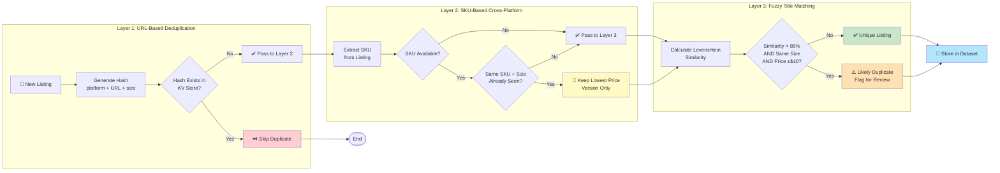

---

## Historical Data Tracking

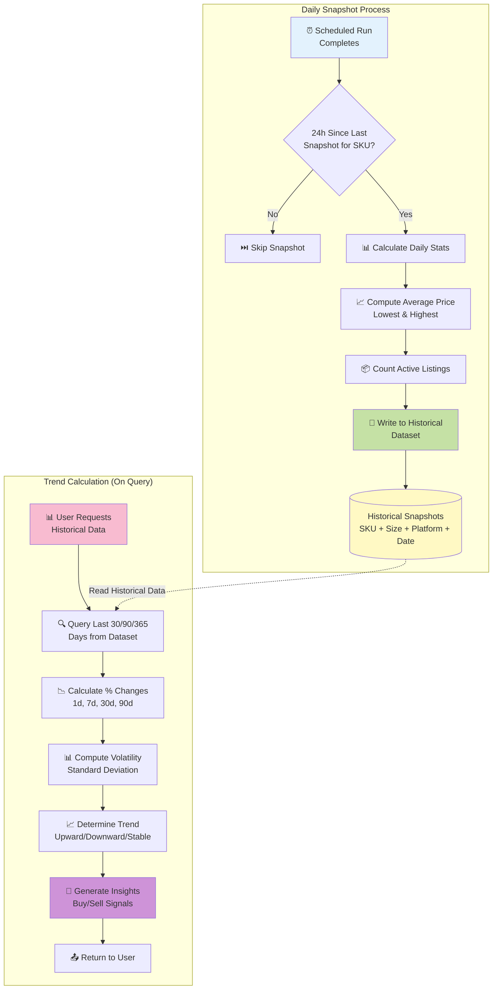

---

## Alert Evaluation Logic

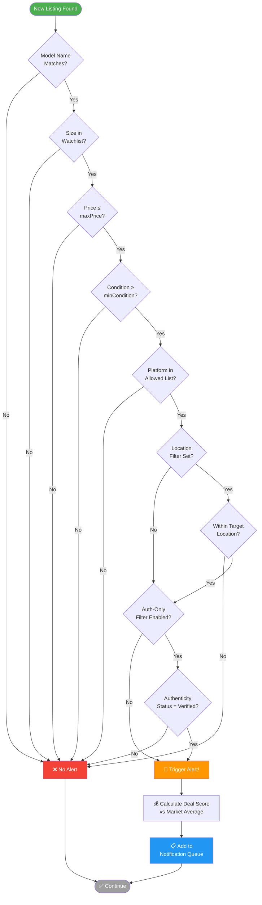

---

## Notification Dispatch Flow

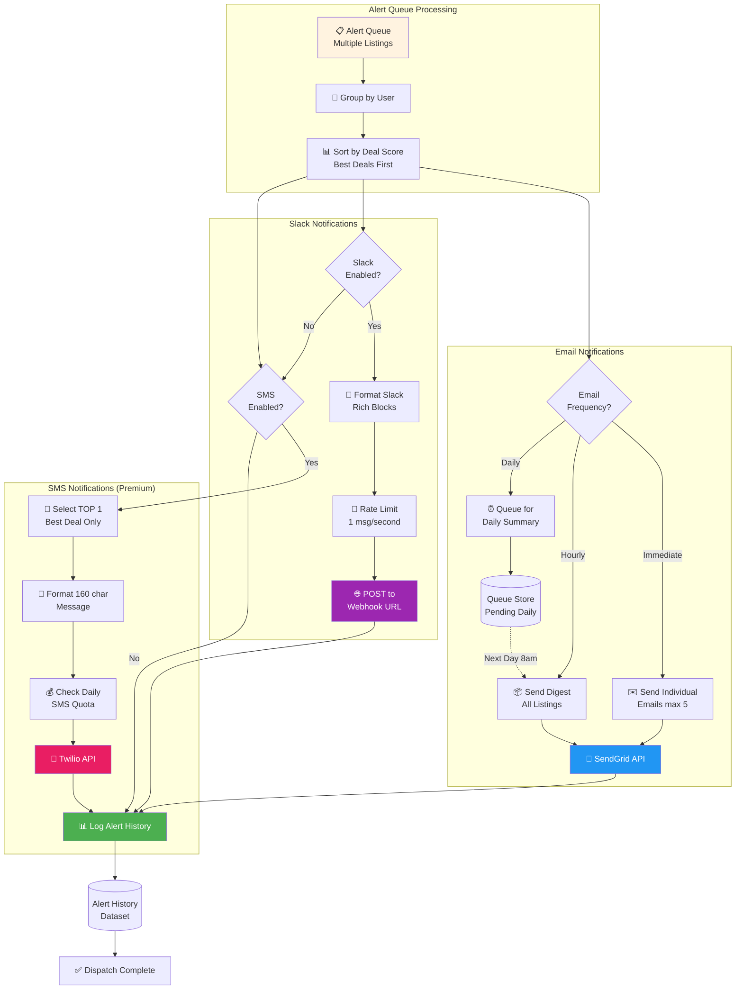

---

## Portfolio Tracking System

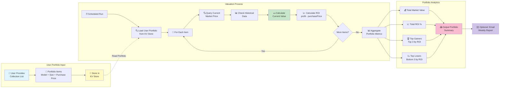

---

## Error Handling & Retry Strategy

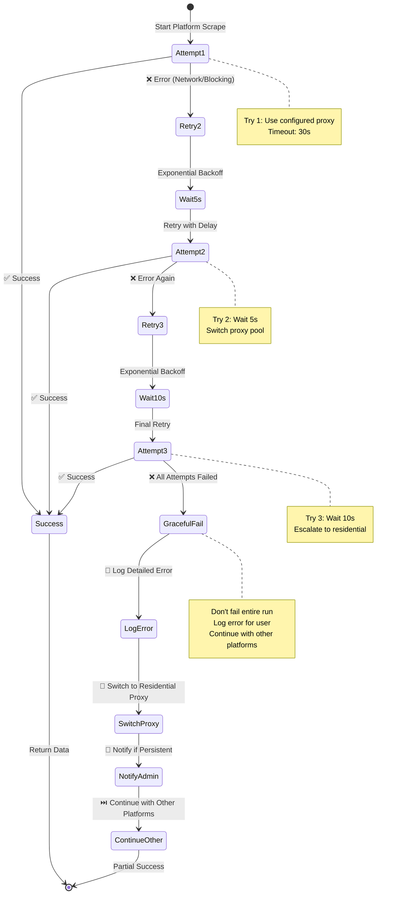

---

## Apify Platform Integration

```mermaid
graph TB
    subgraph "Apify Platform Services"
        A[🎯 Sneaker Collector Actor] --> B[📦 Actor Storage]
        A --> C[🔑 Key-Value Store]
        A --> D[📊 Dataset Storage]
        A --> E[⏰ Scheduler]
        A --> F[🌐 Apify Proxy]
        A --> G[📧 Actor Integrations]

        B --> B1[(Docker Image<br/>Node.js + Code)]
        C --> C1[(KV: Watchlists)]
        C --> C2[(KV: Seen Listings)]
        D --> D1[(DS: Current Listings)]
        D --> D2[(DS: Historical Data)]
        E --> E1[⏰ Cron Scheduler<br/>Hourly/30min/15min]
        F --> F1[🏢 Datacenter Proxies]
        F --> F2[🏠 Residential Proxies]
        G --> G1[✉️ Email Notifications]
        G --> G2[💬 Slack Webhooks]
    end

    subgraph "Sub-Actor Orchestration"
        A --> SA[🔄 Call Sub-Actors<br/>Actor.call()]
        SA --> SA1[ecomscrape/stockx-scraper]
        SA --> SA2[ecomscrape/goat-scraper]
        SA --> SA3[apify/ebay-scraper]
        SA --> SA4[apify/facebook-marketplace]
        SA --> SA5[zscrape/craigslist-scraper]
    end

    subgraph "User Interface"
        UI1[🖥️ Apify Console] --> E
        UI1 --> H[▶️ Manual Run]
        UI1 --> I[📊 View Results]
        UI2[🔌 Apify API] --> J[🤖 External Automation]
    end

    H --> A
    J --> A
    I --> D

    style A fill:#4CAF50,color:#fff
    style B fill:#2196F3,color:#fff
    style C fill:#FF9800,color:#fff
    style D fill:#9C27B0,color:#fff
    style E fill:#F44336,color:#fff
    style F fill:#00BCD4,color:#fff
    style G fill:#8BC34A,color:#fff
```

---

## Challenge Success Pathway

```mermaid
journey
    title Apify $1M Challenge Journey (Nov 2025 - Jan 2026)
    section Week 1-2: MVP Development
        Scaffold Actor: 3: Developer
        Integrate StockX/GOAT: 4: Developer
        Add Email Alerts: 5: Developer
        Write README: 4: Developer
        Publish to Store: 5: Developer, Users
    section Week 3-4: Platform Expansion
        Add Facebook/Craigslist: 4: Developer
        Launch Marketing: 5: Developer, Users
        First 50 Users: 5: Users
        YouTube Tutorial: 5: Developer, Users
    section Week 5-8: Feature Enhancement
        Historical Data: 5: Developer
        Portfolio Tracking: 5: Developer, Users
        Reach 200 MAUs: 5: Users
        Quality Score 75+: 5: Developer
    section Week 9-11: MAU Maximization
        Viral Marketing: 5: Developer, Users
        Discord Partnerships: 5: Users
        500-1000 MAUs: 5: Users
        Grand Prize Consideration: 5: Developer, Users
```

---

## Data Schema Relationships

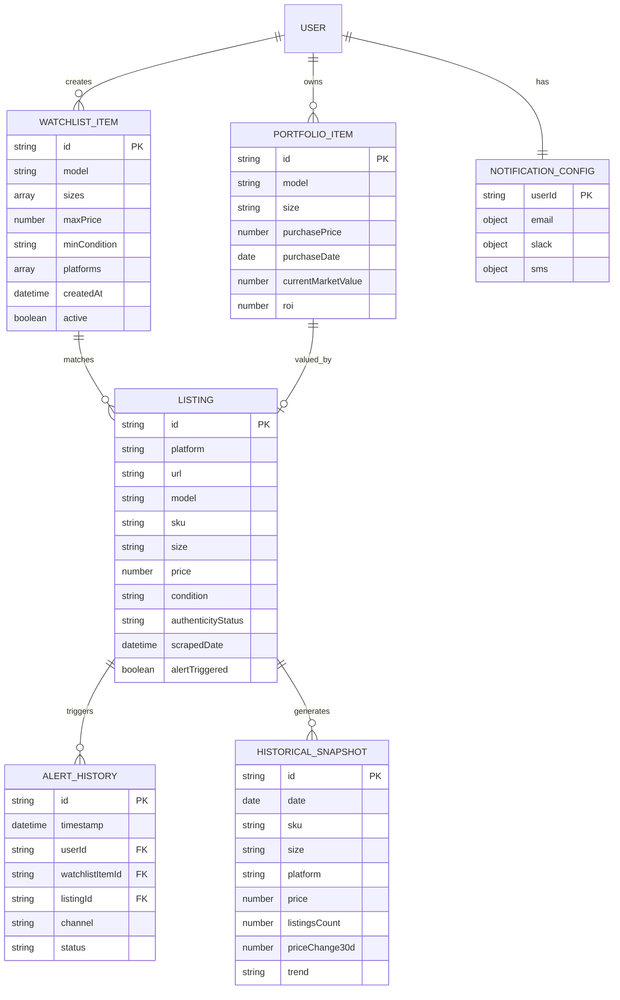

---

## Proxy Strategy Decision Tree

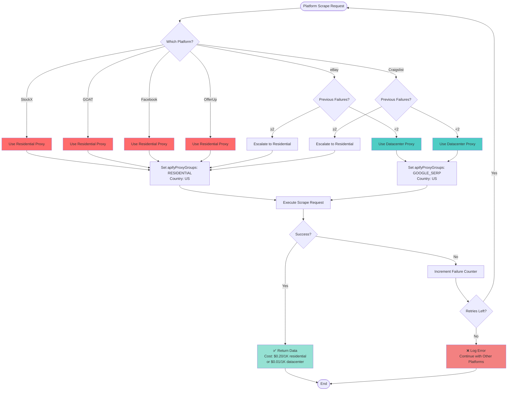

---

## Complete System Context Diagram

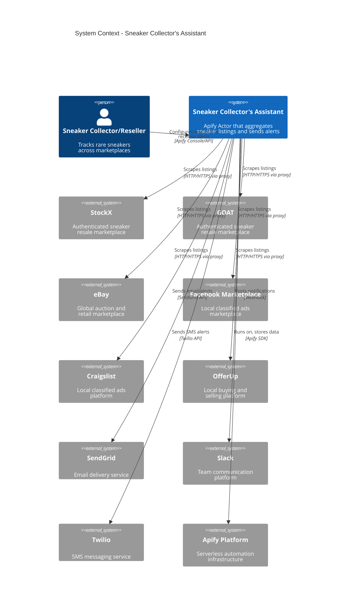

---

## Marketing Funnel Visualization

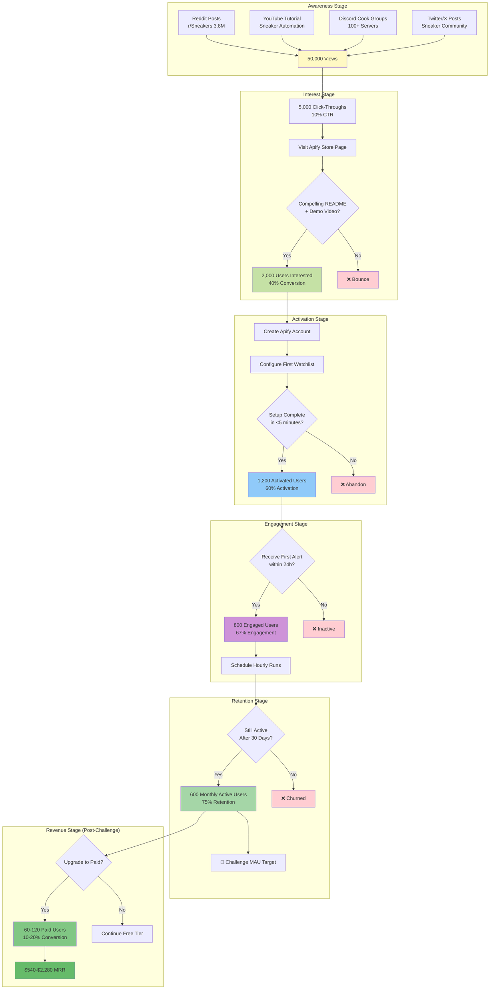

---

## Technology Stack Overview

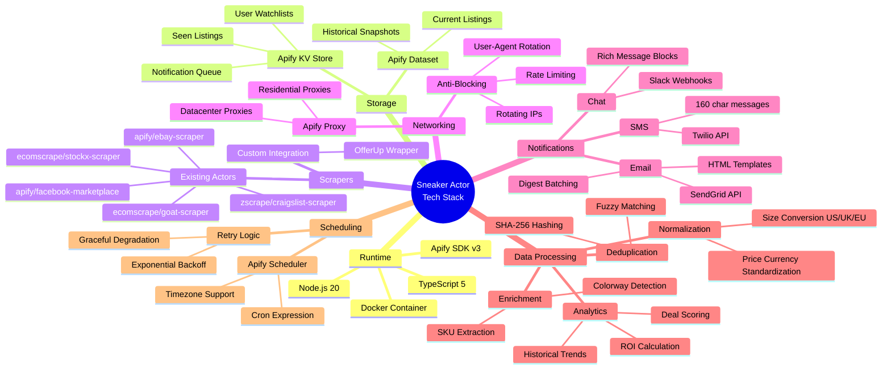

---

## Performance Optimization Strategy

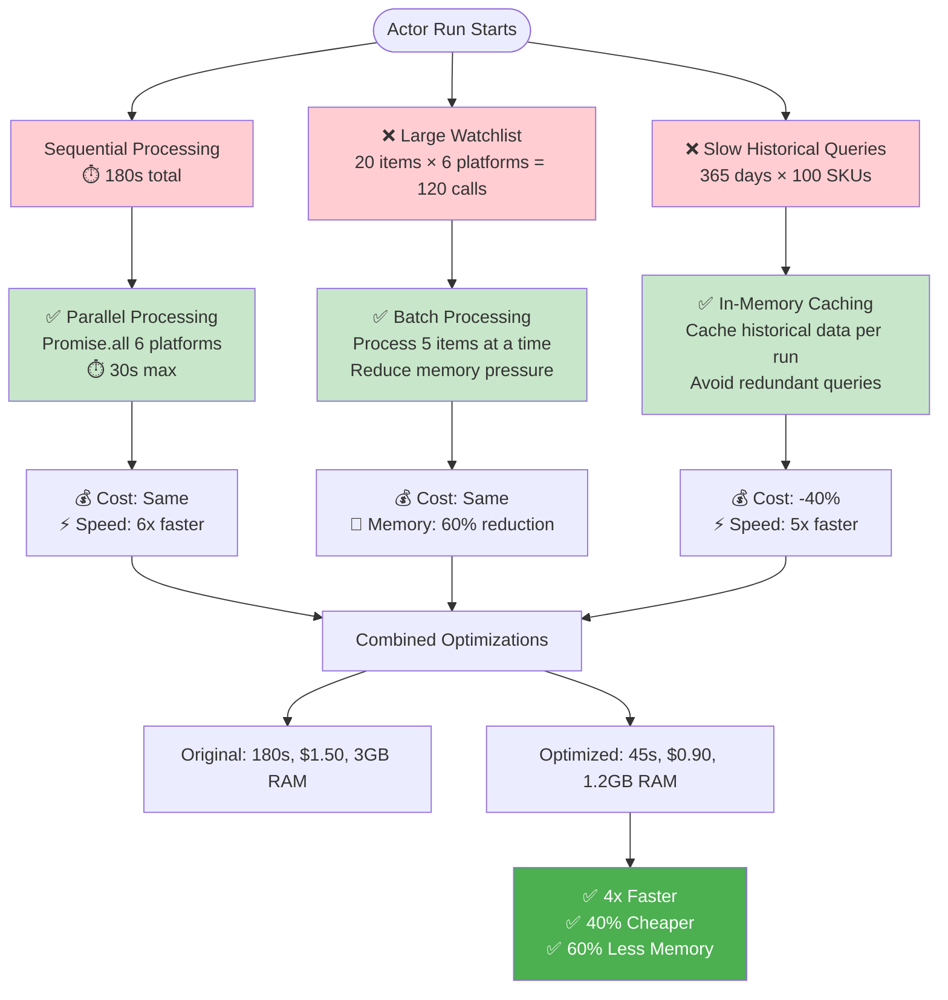

---

These diagrams provide comprehensive visual documentation of the Sneaker Collector's Assistant
architecture, covering:

1. ✅ System Architecture (high-level overview)
2. ✅ Data Flow (detailed step-by-step process)
3. ✅ Marketplace Integration (sequence diagram)
4. ✅ Deduplication Strategy (3-layer approach)
5. ✅ Historical Data Tracking
6. ✅ Alert Evaluation Logic
7. ✅ Notification Dispatch Flow
8. ✅ Portfolio Tracking System
9. ✅ Error Handling & Retry Strategy
10. ✅ Apify Platform Integration
11. ✅ Challenge Success Pathway
12. ✅ Data Schema Relationships (ERD)
13. ✅ Proxy Strategy Decision Tree
14. ✅ System Context (C4 Model)
15. ✅ Marketing Funnel
16. ✅ Technology Stack (Mind Map)
17. ✅ Performance Optimization

You can render these Mermaid diagrams using:

- GitHub/GitLab (native Mermaid support)
- Mermaid Live Editor (https://mermaid.live)
- VS Code with Mermaid extension
- Documentation tools (MkDocs, Docusaurus)

All diagrams can be embedded directly in Markdown documents and will render automatically on most
modern documentation platforms.
