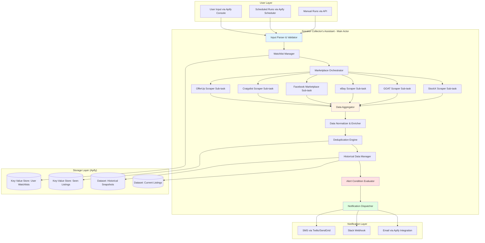

# Sneaker Collector's Assistant - Apify Actor Design Documentation

**Version:** 1.0  
**Date:** November 10, 2025  
**Challenge:** Apify $1M Challenge  
**Deadline:** January 31, 2026  
**Target Quality Score:** 65+ (Aiming for 75+)

---

## Table of Contents

- [1. Executive Summary](#1-executive-summary)
- [2. Market Opportunity](#2-market-opportunity)
- [3. Competitive Differentiation](#3-competitive-differentiation)
- [4. Architecture Overview](#4-architecture-overview)
- [5. Technical Specifications](#5-technical-specifications)
- [6. Marketplace Integrations](#6-marketplace-integrations)
- [7. Search Strategy](#7-search-strategy)
- [8. Notification System](#8-notification-system)
- [9. User Configuration Options](#9-user-configuration-options)
- [10. Data Schema](#10-data-schema)
- [11. Scheduling & Monitoring](#11-scheduling--monitoring)
- [12. Quality Score Strategy](#12-quality-score-strategy)
<!-- markdownlint-disable MD051 -->
- [13. Implementation Roadmap](#implementation-roadmap)
- [14. Pricing Strategy](#pricing-strategy)
- [15. Success Metrics](#success-metrics)
<!-- markdownlint-enable MD051 -->

---

## 1. Executive Summary

### 1.1 Overview

The **Sneaker Collector's Assistant** is a comprehensive Apify actor designed to aggregate, monitor,
and alert users about collectible sneaker listings across multiple marketplaces. It addresses the
critical pain points of sneaker collectors and resellers who currently face information overload,
market fragmentation, and the inability to track rare sneakers efficiently across platforms.

This actor consolidates data from 6+ major marketplaces (StockX, GOAT, eBay, Facebook Marketplace,
Craigslist, OfferUp) into a unified dataset with advanced filtering, historical tracking, and
intelligent alerting capabilities.

### 1.2 Target Users

**Primary Personas:**

1. **Serious Collectors (40%)** - Millennials (30-45 years) looking to acquire grail sneakers for
   personal collections
   - Need: Real-time alerts for rare models in specific sizes
   - Pain point: Missing limited drops across multiple platforms

2. **Part-Time Resellers (35%)** - Individuals flipping 5-20 pairs/month for supplemental income
   - Need: Price comparison, deal identification, market trend data
   - Pain point: Inefficient manual monitoring, margin compression

3. **Professional Resellers (15%)** - Full-time businesses managing 50+ pairs/month
   - Need: Bulk monitoring, historical data, portfolio tracking
   - Pain point: Inventory management, lack of centralized data

4. **Casual Enthusiasts (10%)** - Sneakerheads tracking 1-3 dream sneakers
   - Need: Simple watchlist, low-friction setup
   - Pain point: Complexity of existing tools

### 1.3 Value Proposition

**For Collectors:**

- Never miss a rare listing across 6+ platforms
- Save 10+ hours/week on manual marketplace checking
- Get instant alerts when dream sneakers appear at target prices

**For Resellers:**

- Identify underpriced listings 3-5x faster than competitors
- Track market trends with historical pricing data
- Calculate real-time portfolio value across platforms

**For the Apify Challenge:**

- **High MAU Potential:** 500-1,000 users achievable (sneaker market has 27M collectors in US)
- **Clear Problem-Solution Fit:** Addresses validated pain points in $11.5B market
- **Technical Excellence:** Multi-source aggregation, deduplication, intelligent alerting
- **Freemium Model:** Generous free tier drives user adoption

---

## 2. Market Opportunity

### 2.1 Market Size & Growth

- **Global Sneaker Resale Market:** $11.5B by end of 2025
- **U.S. Sneaker Resale Market:** $6B by end of 2025
- **Estimated Sneaker Collectors in US:** 27M+ (80% millennials aged 30-45)
- **Women's Market Growth:** From 1.6% (2014) to 42.7% (2025) - massive demographic expansion
- **Digital-First Market:** 33%+ of footwear sales now online and growing

### 2.2 Validated Pain Points

Based on market research, collectors and resellers face:

| Pain Point                  | Impact                               | Current Solution Gap                                 | Our Solution                                   |
| --------------------------- | ------------------------------------ | ---------------------------------------------------- | ---------------------------------------------- |
| **Market Fragmentation**    | Must check 6+ platforms manually     | Generic scrapers require separate configurations     | Unified multi-marketplace aggregation          |
| **Information Overload**    | 10-15 hours/week monitoring listings | No centralized monitoring tool                       | Single watchlist with intelligent filtering    |
| **Missing Historical Data** | Can't assess value trends            | StockX historical scraper deprecated                 | Historical price tracking (30/90/365 days)     |
| **Alert Fatigue**           | Generic monitoring too noisy         | Generic "Content Checker" requires per-listing setup | Condition-based alerts (price, size, location) |
| **Authentication Risk**     | 30-40% of market plagued by fakes    | No data integration with auth status                 | Surface authenticity indicators from platforms |
| **Margin Compression**      | Avg profit down to $10-25/pair       | Can't identify underpriced listings fast             | Real-time cross-platform price comparison      |

### 2.3 Market Timing

**Why Now:**

1. **Market Correction (2024-2025):** Oversupply of general releases means collectors focusing on
   rare grails - our target market
2. **Platform Consolidation:** StockX & GOAT dominate but don't provide comparative tools
3. **Tool Abandonment:** Multiple existing Apify actors (Nike, StockX scrapers) are 3+ years old and
   unmaintained
4. **Critical Feature Gap:** Deprecation of `avaritia/stockx-scraper` left no historical data
   solution
5. **Challenge Timing:** 2.5 months to attract users before January 31, 2026 deadline

### 2.4 User Acquisition Potential

**Estimated TAM (Total Addressable Market) on Apify:**

- **Primary Market:** 50,000+ active sneaker resellers using data tools
- **Secondary Market:** 200,000+ serious collectors who'd use monitoring
- **Challenge Goal:** 500-1,000 MAU (Monthly Active Users) = $1,000-$2,000 prize money

**Acquisition Channels:**

- Reddit: r/Sneakers (3.8M members), r/SneakerMarket (175K), r/Repsneakers (800K)
- Discord: 100+ sneaker cook groups with 500-50K members each
- YouTube: Sneaker reselling content creators (500K-2M subs)
- Twitter/X: Sneaker influencers and reselling communities
- SEO: "sneaker monitoring tool", "StockX price tracker", "sneaker alert bot"

---

## 3. Competitive Differentiation

### 3.1 Existing Apify Actors (Competitors)

| Actor                     | Users            | Strengths                  | Critical Weaknesses                                | Our Advantage                |
| ------------------------- | ---------------- | -------------------------- | -------------------------------------------------- | ---------------------------- |
| **StockX Product Search** | 2 MAU (42 total) | Comprehensive StockX data  | Single platform; no alerts; extremely low adoption | Multi-platform + watchlist   |
| **StockX Listings**       | 1 MAU            | Market metrics             | "Under maintenance" 8+ months; effectively dead    | Active maintenance guarantee |
| **StockX Scraper**        | **DEPRECATED**   | Historical sales data      | No longer available                                | Fill critical gap            |
| **GOAT Product Search**   | ~15 MAU          | GOAT integration           | No market data; just listing prices                | Add bid/ask analysis         |
| **Nike Scraper**          | Low              | Multi-region Nike sites    | 3 years old; community-maintained; single brand    | Focus on resale market       |
| **Facebook Marketplace**  | 119 MAU          | Well-maintained by Apify   | Generic tool; no sneaker-specific features         | Sneaker-tailored filtering   |
| **Craigslist Scraper**    | Medium           | Email alerts for new posts | Generic; requires per-query setup                  | Unified watchlist            |

### 3.2 Our Unique Differentiators

**1. Multi-Marketplace Aggregation (Primary Differentiator)**

- **What:** Single query returns data from StockX, GOAT, eBay, Facebook, Craigslist, OfferUp
- **Why It Matters:** Users save 85% of time (6 platforms → 1 search)
- **Implementation:** Leverage existing Apify actors as sub-tasks, orchestrate via our actor

**2. Historical Price & Sales Data (Critical Gap Filler)**

- **What:** Time-series data showing price trends (30/90/365 day windows)
- **Why It Matters:** Essential for valuation; only tool after StockX scraper deprecation
- **Implementation:** Store daily snapshots in Apify dataset, calculate trends

**3. Intelligent Watchlist with Condition-Based Alerts**

- **What:** "Notify when Air Jordan 1 Bred, Size 10, under $250 appears on any platform"
- **Why It Matters:** Generic content checkers require 1 config per listing; we use 1 watchlist
- **Implementation:** User provides watchlist JSON, we run scheduled scans, compare to conditions

**4. Portfolio Value Tracking**

- **What:** Users input their collection (CSV/JSON), we calculate real-time market value
- **Why It Matters:** Investment tracking; no competitor offers this
- **Implementation:** Match user's SKUs to current market prices across platforms

**5. Sneaker-Specific Data Enrichment**

- **What:** Standardize size formats (US/UK/EU), extract SKUs, identify colorway names
- **Why It Matters:** Raw scraped data is messy; we clean and normalize
- **Implementation:** Regex patterns + sneaker database for model/colorway mapping

**6. Freemium Model for Challenge Success**

- **What:** Free tier: 5 watchlist items, hourly scans, 30-day history
- **Why It Matters:** Maximize MAU for $2/user prize pool ($2,000 cap)
- **Implementation:** Usage limits in input validation + Apify billing integration

### 3.3 Competitive Moat

**Short-term (Challenge Period):**

1. First-mover advantage with integrated multi-marketplace approach
2. Fill critical historical data gap before competitors react
3. Aggressive marketing to sneaker communities
4. Superior documentation/UX drives word-of-mouth

**Long-term (Post-Challenge):**

1. Network effects: More users → more data → better insights
2. Historical dataset accumulation (6+ months of trends)
3. Community feedback loop drives feature iteration
4. Potential partnerships with authentication services (CheckCheck, Entrupy)

---

## 4. Architecture Overview

### 4.1 System Architecture Diagram



### 4.2 Component Descriptions

#### 4.2.1 Input Layer

- **Input Parser & Validator:** Validates JSON input schema, checks for required fields
- **Watchlist Manager:** Loads user's watchlist from Key-Value Store, parses watchlist items

#### 4.2.2 Orchestration Layer

- **Marketplace Orchestrator:** Spawns parallel sub-tasks for each marketplace
- **Sub-task Actors:** Leverage existing Apify actors (StockX, GOAT, Facebook, Craigslist, eBay,
  OfferUp scrapers)

#### 4.2.3 Processing Layer

- **Data Aggregator:** Collects results from all marketplace sub-tasks
- **Data Normalizer & Enricher:** Standardizes fields (size, price, currency), enriches with
  SKUs/colorways
- **Deduplication Engine:** Identifies duplicate listings across platforms (same SKU + size)

#### 4.2.4 Intelligence Layer

- **Historical Data Manager:** Stores daily snapshots, calculates 30/90/365-day trends
- **Alert Condition Evaluator:** Checks each listing against user's watchlist conditions
- **Notification Dispatcher:** Sends alerts via configured channels (email/Slack/SMS)

#### 4.2.5 Storage Layer

- **Dataset: Current Listings** - Latest scan results (refreshed each run)
- **Dataset: Historical Snapshots** - Daily price/volume data for trend analysis
- **Key-Value Store: User Watchlists** - Persistent user configurations
- **Key-Value Store: Seen Listings** - Deduplication tracking (30-day TTL)

### 4.3 Data Flow

**Normal Scheduled Run (Hourly):**

1. Scheduler triggers actor at :00 of each hour
2. Input Parser loads user's watchlist from KV Store (e.g., `watchlist-{userId}.json`)
3. For each watchlist item (e.g., "Air Jordan 1 Bred, Size 10, < $250"):
   - Generate search queries for 6 marketplaces
   - Spawn 6 parallel sub-tasks (using `Actor.call()` or `Actor.callTask()`)
4. Each sub-task scrapes its marketplace and returns structured data
5. Aggregator merges results into unified format
6. Normalizer standardizes sizes, prices, dates; enriches with SKUs
7. Deduplication engine checks against "seen listings" KV Store
8. New listings are written to Current Listings dataset
9. Historical Data Manager:
   - Checks if 24 hours since last snapshot for each SKU
   - If yes, writes price point to Historical Snapshots dataset
10. Alert Condition Evaluator:
    - For each new listing, check against all watchlist conditions
    - If match (right model, size, price threshold, location), flag for alert
11. Notification Dispatcher:
    - Group flagged listings by user
    - Send email with summary (Title: "🔥 3 New Sneaker Alerts")
    - Send individual Slack messages per listing (if configured)
12. Actor completes; logs summary stats to output

**First-Time User Setup:**

1. User creates watchlist input JSON via Apify Console
2. Actor runs, detects no previous "seen listings" in KV Store
3. Scrapes all marketplaces, returns baseline results
4. Writes all current listings to "seen listings" (no alerts on first run)
5. Subsequent runs compare against this baseline

### 4.4 Technology Stack

| Component                 | Technology                                         | Rationale                                                       |
| ------------------------- | -------------------------------------------------- | --------------------------------------------------------------- |
| **Actor Runtime**         | Apify SDK v3                                       | Official SDK with orchestration, storage, scheduling            |
| **Language**              | Node.js (TypeScript preferred)                     | Async I/O ideal for parallel scraping; Apify SDK native support |
| **Marketplace Sub-tasks** | Existing Apify Actors                              | Leverage proven solutions; reduce dev time                      |
| **Data Storage**          | Apify Dataset + KV Store                           | Built-in, scalable, included in Apify pricing                   |
| **Deduplication**         | SHA-256 hashing (SKU + size + price)               | Fast lookup in KV Store                                         |
| **Proxies**               | Apify Proxy (Residential)                          | Anti-blocking for StockX, eBay, Facebook                        |
| **Notifications**         | SendGrid API (email), Slack Webhooks, Twilio (SMS) | Battle-tested, developer-friendly APIs                          |
| **Historical Analysis**   | In-memory calculations (averages, trends)          | No external DB needed; dataset queries sufficient               |

---

## 5. Technical Specifications

### 5.1 Apify SDK & Requirements

**SDK Version:**

```json
{
  "dependencies": {
    "apify": "^3.1.0",
    "crawlee": "^3.5.0",
    "typescript": "^5.2.0",
    "@apify/tsconfig": "^0.1.0"
  }
}
```

**Actor System Requirements:**

- **Memory:** 2048 MB (handles parallel sub-tasks + data processing)
- **Timeout:** 3600 seconds (1 hour max for 6 marketplace scrapes)
- **Build:** Dockerfile (Node.js 20-alpine)

**Apify Features Used:**

- `Actor.call()` - Invoke marketplace-specific actors as sub-tasks
- `Actor.openDataset()` - Store listings and historical data
- `Actor.openKeyValueStore()` - User watchlists and deduplication tracking
- `Actor.getValue()` / `Actor.setValue()` - Configuration persistence
- `Actor.log` - Comprehensive logging for debugging
- `Actor.fail()` - Graceful error handling with retry

### 5.2 Input Schema

**File:** `.actor/input_schema.json`

```json
{
  "title": "Sneaker Collector's Assistant Input",
  "type": "object",
  "schemaVersion": 1,
  "properties": {
    "watchlist": {
      "title": "Sneaker Watchlist",
      "type": "array",
      "description": "List of sneaker models, sizes, and conditions to monitor across all marketplaces.",
      "editor": "json",
      "prefill": [
        {
          "model": "Air Jordan 1 High 85 Bred",
          "sizes": ["10", "10.5", "11"],
          "maxPrice": 400,
          "minCondition": "new",
          "platforms": ["stockx", "goat", "ebay", "facebook", "craigslist", "offerup"]
        },
        {
          "model": "Adidas Samba Classic",
          "sizes": ["9", "9.5"],
          "maxPrice": 150,
          "minCondition": "used-like-new",
          "platforms": ["all"]
        }
      ],
      "items": {
        "type": "object",
        "properties": {
          "model": {
            "type": "string",
            "title": "Sneaker Model",
            "description": "Full model name or SKU (e.g., 'Air Jordan 1 Bred', 'BQ4422-001')",
            "editor": "textfield"
          },
          "sizes": {
            "type": "array",
            "title": "Sizes (US)",
            "description": "US sizes to monitor. Use 'all' for any size.",
            "editor": "stringList",
            "items": {
              "type": "string"
            },
            "default": ["all"]
          },
          "maxPrice": {
            "type": "integer",
            "title": "Maximum Price (USD)",
            "description": "Only alert for listings under this price. Leave empty for no limit.",
            "editor": "number",
            "nullable": true
          },
          "minCondition": {
            "type": "string",
            "title": "Minimum Condition",
            "description": "Filter by condition",
            "editor": "select",
            "enum": ["new", "used-like-new", "used-good", "used-fair", "any"],
            "default": "any"
          },
          "platforms": {
            "type": "array",
            "title": "Platforms to Search",
            "description": "Select specific platforms or 'all' for comprehensive search",
            "editor": "stringList",
            "items": {
              "type": "string",
              "enum": ["all", "stockx", "goat", "ebay", "facebook", "craigslist", "offerup"]
            },
            "default": ["all"]
          },
          "locations": {
            "type": "array",
            "title": "Geographic Locations (Optional)",
            "description": "For local marketplaces (Facebook, Craigslist, OfferUp). Specify cities or zip codes.",
            "editor": "stringList",
            "items": {
              "type": "string"
            },
            "default": []
          }
        },
        "required": ["model"]
      }
    },
    "notificationSettings": {
      "title": "Notification Preferences",
      "type": "object",
      "description": "Configure how and when you receive alerts",
      "editor": "json",
      "properties": {
        "email": {
          "type": "object",
          "properties": {
            "enabled": {
              "type": "boolean",
              "title": "Enable Email Alerts",
              "default": true
            },
            "addresses": {
              "type": "array",
              "title": "Email Addresses",
              "items": {
                "type": "string",
                "format": "email"
              },
              "editor": "stringList"
            },
            "frequency": {
              "type": "string",
              "title": "Email Frequency",
              "enum": ["immediate", "hourly-digest", "daily-digest"],
              "default": "immediate"
            }
          }
        },
        "slack": {
          "type": "object",
          "properties": {
            "enabled": {
              "type": "boolean",
              "title": "Enable Slack Alerts",
              "default": false
            },
            "webhookUrl": {
              "type": "string",
              "title": "Slack Webhook URL",
              "editor": "textfield",
              "isSecret": true
            }
          }
        },
        "sms": {
          "type": "object",
          "properties": {
            "enabled": {
              "type": "boolean",
              "title": "Enable SMS Alerts",
              "default": false,
              "description": "Premium feature - SMS charges apply"
            },
            "phoneNumber": {
              "type": "string",
              "title": "Phone Number",
              "editor": "textfield",
              "pattern": "^\\+[1-9]\\d{1,14}$"
            }
          }
        }
      }
    },
    "searchOptions": {
      "title": "Advanced Search Options",
      "type": "object",
      "description": "Fine-tune search behavior and filtering",
      "editor": "json",
      "properties": {
        "includeVariants": {
          "type": "boolean",
          "title": "Include Model Variants",
          "description": "Search for similar colorways/collaborations (e.g., 'Jordan 1' includes 'Jordan 1 Chicago', 'Jordan 1 Bred')",
          "default": true
        },
        "historicalDays": {
          "type": "integer",
          "title": "Historical Price Window (Days)",
          "description": "Track price history for this many days (30, 90, or 365)",
          "enum": [30, 90, 365],
          "default": 90
        },
        "deduplicationWindow": {
          "type": "integer",
          "title": "Deduplication Window (Hours)",
          "description": "Suppress alerts for same listing within this time window",
          "default": 24,
          "minimum": 1,
          "maximum": 168
        },
        "proxyType": {
          "type": "string",
          "title": "Proxy Type",
          "description": "Residential proxies reduce blocking risk but cost more",
          "enum": ["datacenter", "residential"],
          "default": "residential"
        }
      }
    },
    "portfolioTracking": {
      "title": "Portfolio Tracking (Optional)",
      "type": "object",
      "description": "Track the market value of your existing sneaker collection",
      "editor": "json",
      "properties": {
        "enabled": {
          "type": "boolean",
          "title": "Enable Portfolio Tracking",
          "default": false
        },
        "collection": {
          "type": "array",
          "title": "Your Collection",
          "description": "List of sneakers you own. We'll track their current market value.",
          "items": {
            "type": "object",
            "properties": {
              "model": {
                "type": "string",
                "title": "Model Name or SKU"
              },
              "size": {
                "type": "string",
                "title": "Size (US)"
              },
              "condition": {
                "type": "string",
                "enum": ["new", "used-like-new", "used-good"],
                "default": "new"
              },
              "purchasePrice": {
                "type": "number",
                "title": "Purchase Price (USD)",
                "description": "Optional: Track ROI"
              },
              "purchaseDate": {
                "type": "string",
                "title": "Purchase Date",
                "format": "date"
              }
            },
            "required": ["model", "size"]
          }
        }
      }
    }
  },
  "required": ["watchlist"]
}
```

### 5.3 Output Schema

**File:** `OUTPUT_SCHEMA.json`

```json
{
  "title": "Sneaker Collector's Assistant Output",
  "type": "object",
  "schemaVersion": 1,
  "properties": {
    "runMetadata": {
      "type": "object",
      "title": "Run Metadata",
      "properties": {
        "runId": {
          "type": "string",
          "description": "Apify run ID"
        },
        "timestamp": {
          "type": "string",
          "format": "date-time"
        },
        "watchlistItemsProcessed": {
          "type": "integer"
        },
        "totalListingsFound": {
          "type": "integer"
        },
        "newListings": {
          "type": "integer"
        },
        "alertsSent": {
          "type": "integer"
        },
        "platformsScraped": {
          "type": "array",
          "items": {
            "type": "string"
          }
        }
      }
    },
    "listings": {
      "type": "array",
      "title": "New Listings Found",
      "items": {
        "type": "object",
        "properties": {
          "id": {
            "type": "string",
            "description": "Unique listing ID (hash of platform + URL)"
          },
          "platform": {
            "type": "string",
            "enum": ["stockx", "goat", "ebay", "facebook", "craigslist", "offerup"]
          },
          "url": {
            "type": "string",
            "format": "uri"
          },
          "model": {
            "type": "string",
            "description": "Sneaker model name"
          },
          "sku": {
            "type": "string",
            "description": "Manufacturer SKU (if available)"
          },
          "colorway": {
            "type": "string",
            "description": "Colorway name (e.g., 'Bred', 'Chicago')"
          },
          "size": {
            "type": "string",
            "description": "Size in US format"
          },
          "sizeEU": {
            "type": "string"
          },
          "sizeUK": {
            "type": "string"
          },
          "price": {
            "type": "number",
            "description": "Price in USD"
          },
          "currency": {
            "type": "string",
            "default": "USD"
          },
          "condition": {
            "type": "string",
            "enum": ["new", "used-like-new", "used-good", "used-fair", "unknown"]
          },
          "seller": {
            "type": "object",
            "properties": {
              "name": {
                "type": "string"
              },
              "rating": {
                "type": "number"
              },
              "location": {
                "type": "string"
              }
            }
          },
          "images": {
            "type": "array",
            "items": {
              "type": "string",
              "format": "uri"
            }
          },
          "postedDate": {
            "type": "string",
            "format": "date-time"
          },
          "scrapedDate": {
            "type": "string",
            "format": "date-time"
          },
          "authenticityStatus": {
            "type": "string",
            "enum": ["verified", "unverified", "unknown"],
            "description": "StockX/GOAT verify authenticity; others are unverified"
          },
          "matchedWatchlistItems": {
            "type": "array",
            "description": "Which watchlist items this listing matched",
            "items": {
              "type": "string"
            }
          },
          "alertTriggered": {
            "type": "boolean",
            "description": "Whether this listing triggered an alert"
          }
        },
        "required": ["id", "platform", "url", "model", "price"]
      }
    },
    "historicalData": {
      "type": "object",
      "title": "Historical Price Trends",
      "description": "Price trends for watchlist items (if historical tracking enabled)",
      "additionalProperties": {
        "type": "object",
        "properties": {
          "model": {
            "type": "string"
          },
          "size": {
            "type": "string"
          },
          "platform": {
            "type": "string"
          },
          "currentPrice": {
            "type": "number"
          },
          "priceHistory": {
            "type": "array",
            "items": {
              "type": "object",
              "properties": {
                "date": {
                  "type": "string",
                  "format": "date"
                },
                "price": {
                  "type": "number"
                },
                "volume": {
                  "type": "integer",
                  "description": "Number of sales (if available)"
                }
              }
            }
          },
          "trend": {
            "type": "string",
            "enum": ["upward", "downward", "stable"],
            "description": "30-day price trend"
          },
          "priceChange30d": {
            "type": "number",
            "description": "% change over 30 days"
          },
          "priceChange90d": {
            "type": "number"
          },
          "priceChange365d": {
            "type": "number"
          },
          "volatility": {
            "type": "string",
            "enum": ["low", "medium", "high"],
            "description": "Price volatility indicator"
          }
        }
      }
    },
    "portfolioSummary": {
      "type": "object",
      "title": "Portfolio Valuation",
      "description": "Market value of user's collection (if portfolio tracking enabled)",
      "properties": {
        "totalItems": {
          "type": "integer"
        },
        "totalMarketValue": {
          "type": "number",
          "description": "Current market value (USD)"
        },
        "totalPurchasePrice": {
          "type": "number",
          "description": "Total amount paid (if provided)"
        },
        "totalROI": {
          "type": "number",
          "description": "Return on investment (%)"
        },
        "totalProfit": {
          "type": "number",
          "description": "Market value - purchase price"
        },
        "topGainers": {
          "type": "array",
          "description": "Top 3 sneakers by ROI",
          "items": {
            "type": "object",
            "properties": {
              "model": {
                "type": "string"
              },
              "size": {
                "type": "string"
              },
              "purchasePrice": {
                "type": "number"
              },
              "currentValue": {
                "type": "number"
              },
              "roi": {
                "type": "number"
              }
            }
          }
        },
        "topLosers": {
          "type": "array",
          "description": "Top 3 sneakers by negative ROI"
        }
      }
    },
    "errors": {
      "type": "array",
      "title": "Errors Encountered",
      "items": {
        "type": "object",
        "properties": {
          "platform": {
            "type": "string"
          },
          "errorMessage": {
            "type": "string"
          },
          "timestamp": {
            "type": "string",
            "format": "date-time"
          }
        }
      }
    }
  }
}
```

### 5.4 Storage Strategy

#### Dataset: `sneaker-listings-current`

- **Purpose:** Store all listings found in current run
- **Retention:** 30 days (configurable)
- **Size Estimate:** ~1,000-5,000 rows per run (depends on watchlist size)
- **Access Pattern:** Write during run, read for historical comparison

#### Dataset: `sneaker-listings-historical`

- **Purpose:** Daily snapshots of price/volume for trend analysis
- **Schema:** `{ date, model, size, platform, price, volume, source }`
- **Retention:** 365 days (user-configurable: 30/90/365)
- **Size Estimate:** ~100 rows/day per watchlist item
- **Access Pattern:** Append-only writes, batch reads for trend calculation

#### Key-Value Store: `watchlists`

- **Keys:** `watchlist-{userId}.json` (or `default.json` for single-user runs)
- **Purpose:** Persist user watchlist configurations
- **Update Frequency:** Only when user updates configuration

#### Key-Value Store: `seen-listings`

- **Keys:** `listing-{hash}.json` where hash = SHA256(platform + url + size)
- **Purpose:** Track seen listings for deduplication
- **Retention:** 24-168 hours (configurable `deduplicationWindow`)
- **Access Pattern:** High-frequency reads/writes during each run

#### Key-Value Store: `notification-queue`

- **Keys:** `alerts-{runId}.json`
- **Purpose:** Queue alerts for batch sending (avoid rate limits)
- **Retention:** 1 hour (deleted after dispatch)

---

## 6. Marketplace Integrations

### 6.1 Integration Strategy

We leverage existing Apify actors as sub-tasks to minimize development time and maximize
reliability. Each marketplace integration:

1. **Calls existing Apify actor** via `Actor.call()`
2. **Transforms actor-specific output** to our unified schema
3. **Handles actor-specific quirks** (e.g., pagination, rate limits)
4. **Falls back gracefully** if actor fails (log error, continue with other platforms)

### 6.2 StockX Integration (Priority #1)

**Actor:** `ecomscrape/stockx-product-search-scraper` (42 total users, 2 MAU)

**Why Priority:**

- Leading authenticated resale platform
- Best price data (bid/ask spreads)
- Our historical data feature fills gap from deprecated actor

**Data Available:**

- Product name, brand, SKU, colorway
- Lowest ask, highest bid, last sale price
- 52-week high/low prices
- Total sales count
- Premium vs. retail price
- Size availability and pricing
- Product images

**Integration Approach:**

```javascript
// Pseudo-code for StockX integration
async function scrapeStockX(searchQuery, sizes) {
  const input = {
    searchQuery: searchQuery, // e.g., "Air Jordan 1 Bred"
    maxResults: 50,
    proxy: {
      useApifyProxy: true,
      apifyProxyGroups: ['RESIDENTIAL'],
    },
  };

  const run = await Actor.call('ecomscrape/stockx-product-search-scraper', input);
  const { items } = await run.dataset().getData();

  // Transform to our schema
  return items
    .map((item) => {
      const normalizedSize = item.size || item.sizeLabel || extractSizeFromTitle(item.title);
      return {
        id: generateHash('stockx', item.url),
        platform: 'stockx',
        url: item.url,
        model: item.title,
        sku: item.styleId,
        colorway: item.colorway,
        price: item.lowestAsk, // Use lowest ask as "price"
        size: normalizedSize,
        marketData: {
          lowestAsk: item.lowestAsk,
          highestBid: item.highestBid,
          lastSale: item.lastSale,
          salesLast72h: item.deadstockSold,
        },
        authenticityStatus: 'verified',
        scrapedDate: new Date().toISOString(),
      };
    })
    .filter((item) => sizes.includes('all') || (item.size && sizes.includes(item.size)));
}
```

**Historical Data Strategy:**

- On first run for a SKU, scrape current price
- On subsequent runs (24h+ later), append new price point to historical dataset
- Calculate trends: `priceChange30d = ((currentPrice - price30daysAgo) / price30daysAgo) * 100`

**Rate Limiting:**

- StockX is strict; use residential proxies (set `apifyProxyGroups: ['RESIDENTIAL']`)
- Max 1 request per 2 seconds per IP
- Actor handles this automatically

### 6.3 GOAT Integration (Priority #1)

**Actor:** `ecomscrape/goat-product-search-scraper` (~15 MAU)

**Why Priority:**

- Second-largest authenticated platform
- More flexible (new + used)
- Merged with Flight Club (premium consignment)

**Data Available:**

- Product name, brand, SKU
- Current listing price (no bid/ask)
- Release date
- Size availability
- Product images
- "Instant ship" indicator

**Integration Approach:**

```javascript
async function scrapeGOAT(searchQuery, sizes) {
  const input = {
    searchQuery: searchQuery,
    maxProducts: 50,
    proxy: {
      useApifyProxy: true,
      apifyProxyGroups: ['RESIDENTIAL'],
    },
  };

  const run = await Actor.call('ecomscrape/goat-product-search-scraper', input);
  const { items } = await run.dataset().getData();

  return items
    .map((item) => {
      const normalizedSize = item.size || item.sizeLabel || item.sizeUS || null;
      return {
        id: generateHash('goat', item.url),
        platform: 'goat',
        url: item.url,
        model: item.name,
        sku: item.sku,
        price: item.lowestPriceCents / 100, // Convert cents to dollars
        condition: item.condition || 'new',
        size: normalizedSize,
        authenticityStatus: 'verified',
        scrapedDate: new Date().toISOString(),
      };
    })
    .filter((item) => sizes.includes('all') || (item.size && sizes.includes(item.size)));
}
```

**Comparison Feature:**

- For each SKU + size, compare StockX lowest ask vs. GOAT price
- Flag deals: `if (goatPrice < stockxPrice * 0.95) { listing.isDeal = true; }`

### 6.4 eBay Integration (Priority #2)

**Actor:** `apify/ebay-scraper` or community alternatives

**Why Priority #2:**

- Massive inventory (new + used)
- Authenticity Guarantee program for $100+ sneakers
- Lower seller fees attract deals

**Data Available:**

- Product title (user-generated, messy)
- Price (auction or buy-it-now)
- Seller info (rating, feedback)
- Shipping cost
- Authenticity Guarantee badge
- Product images

**Integration Challenges:**

- **Unstructured Data:** Titles like "Nike Jordan 1 sz 10 VNDS" require parsing
- **Solution:** Regex patterns to extract model, size, condition keywords

```javascript
async function scrapeEbay(searchQuery, sizes) {
  const input = {
    searchKeyword: searchQuery,
    maxItems: 100,
    categoryId: 15709, // Men's Athletic Shoes category
    conditionIds: [1000, 1500, 2000], // New, New with box, Pre-owned
    proxy: {
      useApifyProxy: true,
    },
  };

  const run = await Actor.call('apify/ebay-scraper', input);
  const { items } = await run.dataset().getData();

  return items
    .map((item) => ({
      id: generateHash('ebay', item.url),
      platform: 'ebay',
      url: item.url,
      model: cleanTitle(item.title), // Remove size/condition clutter
      size: extractSizeFromTitle(item.title + ' ' + item.description),
      price: parseFloat(item.price.replace(/[^0-9.]/g, '')),
      condition: extractConditionFromTitle(item.description || ''),
      seller: {
        name: item.seller.username,
        rating: item.seller.feedbackScore,
        location: item.location,
      },
      images: item.images,
      postedDate: item.creationTime,
      authenticityStatus: item.authenticityGuarantee ? 'verified' : 'unverified',
      scrapedDate: new Date().toISOString(),
    }))
    .filter((item) => item.size && (sizes.includes('all') || sizes.includes(item.size)));
}

// Helper: Extract size from messy titles
function extractSizeFromTitle(title) {
  const patterns = [
    /\bsize\s*(\d+\.?\d*)\b/i,
    /\bsz\s*(\d+\.?\d*)\b/i,
    /\bus\s*(\d+\.?\d*)\b/i,
    /\b(\d+\.?\d*)\s*(us|uk|eu)?\b/i,
  ];

  for (const pattern of patterns) {
    const match = title.match(pattern);
    if (match) return match[1];
  }
  return null;
}

// Helper: Extract condition keywords
function extractConditionFromTitle(title) {
  const lower = title.toLowerCase();
  if (lower.includes('deadstock') || lower.includes('ds') || lower.includes('brand new'))
    return 'new';
  if (lower.includes('vnds') || lower.includes('9.5/10')) return 'used-like-new';
  if (lower.includes('used') || lower.includes('worn')) return 'used-good';
  return 'unknown';
}
```

**Authenticity Guarantee Details:**

- eBay verifies sneakers $100+ before shipping
- Actor should flag these listings: `authenticityStatus: 'verified'`
- Key differentiator for eBay vs. Craigslist/Facebook

### 6.5 Facebook Marketplace Integration (Priority #2)

**Actor:** `apify/facebook-marketplace-scraper` (119 MAU - very popular)

**Why Priority #2:**

- Largest local marketplace (2.9B Facebook users)
- Often underpriced (casual sellers)
- Supports location-based search

**Data Available:**

- Listing title, price, description
- Seller profile (name, location)
- Post date
- Images
- Location (city-level)

**Integration Approach:**

```javascript
async function scrapeFacebook(searchQuery, sizes, locations) {
  // Facebook requires city-specific URLs
  const results = [];

  for (const location of locations) {
    const input = {
      searchQuery: searchQuery,
      location: location, // e.g., "San Francisco, CA"
      maxItems: 50,
      proxy: {
        useApifyProxy: true,
        apifyProxyGroups: ['RESIDENTIAL'],
      },
    };

    const run = await Actor.call('apify/facebook-marketplace-scraper', input);
    const { items } = await run.dataset().getData();

    results.push(
      ...items.map((item) => ({
        id: generateHash('facebook', item.url),
        platform: 'facebook',
        url: item.url,
        model: item.title,
        size: extractSizeFromTitle(item.title + ' ' + item.description),
        price: parseFloat(item.price.replace(/[^0-9.]/g, '')),
        condition: extractConditionFromTitle(item.description || ''),
        seller: {
          name: item.sellerName,
          location: item.location,
        },
        images: item.images,
        postedDate: item.creationTime,
        authenticityStatus: 'unverified',
        scrapedDate: new Date().toISOString(),
      }))
    );
  }

  return results.filter(
    (item) => item.size && (sizes.includes('all') || sizes.includes(item.size))
  );
}
```

**Location Strategy:**

- Default locations if user doesn't specify: Top 20 US metro areas
- OR: Use `locations: ["nationwide"]` to scrape without location filter (slower, more results)

**Anti-Blocking:**

- Facebook is aggressive with blocking
- **Must use residential proxies** (`apifyProxyGroups: ['RESIDENTIAL']`)
- Limit to 50 items per location per run

### 6.6 Craigslist Integration (Priority #3)

**Actor:** `zscrape/craigslist-scraper` (has email alert feature)

**Why Priority #3:**

- Still popular for local sales
- Email alert feature already exists (we can enhance)
- Less competition than Facebook

**Data Available:**

- Posting title, price, description
- Location (neighborhood-level)
- Post date
- Images (if uploaded)
- Seller email (obfuscated)

**Integration Approach:**

```javascript
async function scrapeCraigslist(searchQuery, sizes, locations) {
  const results = [];

  for (const location of locations) {
    const cityDomain = getCraigslistDomain(location); // e.g., "newyork.craigslist.org"

    const input = {
      searchUrls: [`https://${cityDomain}/search/sss?query=${encodeURIComponent(searchQuery)}`],
      maxResults: 100,
      sendEmailAlerts: false, // We handle our own alerts
      proxy: {
        useApifyProxy: true,
      },
    };

    const run = await Actor.call('zscrape/craigslist-scraper', input);
    const { items } = await run.dataset().getData();

    results.push(
      ...items.map((item) => ({
        id: generateHash('craigslist', item.url),
        platform: 'craigslist',
        url: item.url,
        model: item.title,
        size: extractSizeFromTitle(item.title + ' ' + item.description),
        price: item.price,
        condition: extractConditionFromTitle(item.description || ''),
        seller: {
          location: item.location,
        },
        images: item.images,
        postedDate: item.datetime,
        authenticityStatus: 'unverified',
        scrapedDate: new Date().toISOString(),
      }))
    );
  }

  return results.filter(
    (item) => item.size && (sizes.includes('all') || sizes.includes(item.size))
  );
}

// Helper: Map city names to Craigslist subdomains
function getCraigslistDomain(city) {
  const mapping = {
    'San Francisco': 'sfbay',
    'New York': 'newyork',
    'Los Angeles': 'losangeles',
    Chicago: 'chicago',
    Houston: 'houston',
    // ... (expand to top 50 US cities)
  };
  return `${mapping[city] || 'geo'}.craigslist.org`;
}
```

### 6.7 OfferUp Integration (Priority #3)

**Actor:** Custom actor or community `offerup-scraper`

**Why Priority #3:**

- Popular in US (especially West Coast)
- Mobile-first platform
- Good for local deals

**Data Available:**

- Listing title, price, description
- Seller profile (rating, response time)
- Location (zip code)
- Shipping availability
- Product images

**Integration Approach:**

```javascript
async function scrapeOfferUp(searchQuery, sizes, zipCodes) {
  const results = [];

  for (const zipCode of zipCodes) {
    const input = {
      searchTerm: searchQuery,
      zipCode: zipCode,
      radius: 25, // Miles
      maxResults: 50,
      proxy: {
        useApifyProxy: true,
        apifyProxyGroups: ['RESIDENTIAL'],
      },
    };

    const run = await Actor.call('community/offerup-scraper', input);
    const { items } = await run.dataset().getData();

    results.push(
      ...items.map((item) => ({
        id: generateHash('offerup', item.url),
        platform: 'offerup',
        url: item.url,
        model: item.title,
        size: extractSizeFromTitle(item.title + ' ' + item.description),
        price: item.price,
        condition: item.condition || extractConditionFromTitle(item.description),
        seller: {
          name: item.seller.name,
          rating: item.seller.rating,
          location: item.location,
        },
        images: item.images,
        postedDate: item.postedDate,
        authenticityStatus: 'unverified',
        scrapedDate: new Date().toISOString(),
      }))
    );
  }

  return results.filter(
    (item) => item.size && (sizes.includes('all') || sizes.includes(item.size))
  );
}
```

### 6.8 Marketplace Integration Summary

| Platform       | Priority | Actor                                      | MAU    | Proxy Type  | Data Quality         | Authenticity     | Cost per Run |
| -------------- | -------- | ------------------------------------------ | ------ | ----------- | -------------------- | ---------------- | ------------ |
| **StockX**     | 1        | `ecomscrape/stockx-product-search-scraper` | 2      | Residential | ⭐⭐⭐⭐⭐ Excellent | ✅ Verified      | $0.10-0.30   |
| **GOAT**       | 1        | `ecomscrape/goat-product-search-scraper`   | 15     | Residential | ⭐⭐⭐⭐⭐ Excellent | ✅ Verified      | $0.10-0.30   |
| **eBay**       | 2        | `apify/ebay-scraper`                       | High   | Datacenter  | ⭐⭐⭐⭐ Good        | ⚠️ Some verified | $0.05-0.15   |
| **Facebook**   | 2        | `apify/facebook-marketplace-scraper`       | 119    | Residential | ⭐⭐⭐ Fair          | ❌ Unverified    | $0.15-0.40   |
| **Craigslist** | 3        | `zscrape/craigslist-scraper`               | Medium | Datacenter  | ⭐⭐ Poor            | ❌ Unverified    | $0.05-0.10   |
| **OfferUp**    | 3        | Custom/community                           | Low    | Residential | ⭐⭐⭐ Fair          | ❌ Unverified    | $0.10-0.20   |

**Total Estimated Cost per Hourly Run:** $0.55 - $1.45 (depends on watchlist size and platform
selection)

**Optimization Strategy:**

- **Free Tier Users:** StockX + GOAT only (best data, authenticated)
- **Paid Tier Users:** All 6 platforms for comprehensive coverage

---

## 7. Search Strategy

### 7.1 Top 10 Sneaker Models (Default Watchlist)

Based on market research, these models have the highest collector demand and resale value in 2025:

| Rank   | Model                          | Why It's Hot                                       | Avg Resale Price | Search Variations                                                         |
| ------ | ------------------------------ | -------------------------------------------------- | ---------------- | ------------------------------------------------------------------------- |
| **1**  | **Air Jordan 1 High '85 Bred** | Limited 23K pairs; historical significance         | $350-$600        | "Air Jordan 1 Bred", "AJ1 Bred", "Jordan 1 Black Red", "BQ4422-001"       |
| **2**  | **Air Jordan 1 High Chicago**  | Iconic colorway; perpetual demand                  | $300-$500        | "Air Jordan 1 Chicago", "AJ1 Chicago", "Jordan 1 White Red", "555088-101" |
| **3**  | **Adidas Samba Classic**       | Minimalist trend; Wales Bonner collabs             | $100-$250        | "Adidas Samba", "Samba OG", "Samba Wales Bonner"                          |
| **4**  | **Nike Air Force 1 Low**       | Global bestseller; customization base              | $90-$200         | "Air Force 1", "AF1", "Nike Air Force Low"                                |
| **5**  | **New Balance 990v6**          | Premium materials; collabs with Action Bronson     | $180-$350        | "New Balance 990v6", "NB 990v6", "990 v6"                                 |
| **6**  | **New Balance 9060**           | Chunky trend; JJJJound/Aime Leon Dore collabs      | $150-$300        | "New Balance 9060", "NB 9060"                                             |
| **7**  | **Puma Speedcat**              | Balletcore trend; laceless variants                | $120-$200        | "Puma Speedcat", "Speedcat Ballet", "Speedcat OG"                         |
| **8**  | **ASICS GEL-KAYANO 14**        | Gorpcore trend; Cecilie Bahnsen collabs            | $130-$250        | "ASICS Gel Kayano 14", "Kayano 14", "GEL-KAYANO 14"                       |
| **9**  | **Nike Dunk Low**              | Wide variety of colorways; accessible entry        | $100-$300        | "Nike Dunk Low", "Dunk Low", "SB Dunk"                                    |
| **10** | **Yeezy Boost 350 V2**         | Despite Adidas split, classic colorways hold value | $150-$350        | "Yeezy 350", "Yeezy Boost 350", "Yeezy V2"                                |

### 7.2 Search Query Generation

**Challenge:** Different platforms use different naming conventions.

**Solution:** Generate 3-5 query variations per model:

```javascript
function generateSearchQueries(model) {
  const baseModel = model.trim();

  // Known abbreviations
  const abbreviations = {
    'Air Jordan': ['AJ', 'Jordan', 'J'],
    'Air Force': ['AF'],
    'New Balance': ['NB'],
    'Nike SB Dunk': ['Dunk SB', 'SB Dunk', 'Nike Dunk'],
  };

  // Generate variants
  const queries = [baseModel]; // Original query

  // Add common misspellings
  queries.push(baseModel.replace(/\s+/g, '')); // No spaces: "AirJordan1"

  // Add abbreviations
  for (const [full, abbrevs] of Object.entries(abbreviations)) {
    if (baseModel.includes(full)) {
      abbrevs.forEach((abbrev) => {
        queries.push(baseModel.replace(full, abbrev));
      });
    }
  }

  // Add SKU if available (most precise)
  const sku = lookupSKU(baseModel);
  if (sku) queries.push(sku);

  return [...new Set(queries)]; // Deduplicate
}

// Example output for "Air Jordan 1 Bred":
// ["Air Jordan 1 Bred", "AJ1 Bred", "Jordan 1 Bred", "J1 Bred", "BQ4422-001"]
```

### 7.3 Size Filtering

**Supported Size Systems:**

- US (primary)
- UK (convert to US)
- EU (convert to US)

**Size Conversion Table:**

```javascript
const sizeConversions = {
  // US Men's : { UK, EU }
  7: { uk: '6', eu: '40' },
  7.5: { uk: '6.5', eu: '40.5' },
  8: { uk: '7', eu: '41' },
  8.5: { uk: '7.5', eu: '42' },
  9: { uk: '8', eu: '42.5' },
  9.5: { uk: '8.5', eu: '43' },
  10: { uk: '9', eu: '44' },
  10.5: { uk: '9.5', eu: '44.5' },
  11: { uk: '10', eu: '45' },
  11.5: { uk: '10.5', eu: '45.5' },
  12: { uk: '11', eu: '46' },
  12.5: { uk: '11.5', eu: '47' },
  13: { uk: '12', eu: '47.5' },
  // ... (expand to full range 4-18)
};

function normalizeSizeToUS(size, system = 'US') {
  if (system === 'US') return size;

  // Reverse lookup for UK/EU
  for (const [us, conversions] of Object.entries(sizeConversions)) {
    if (system === 'UK' && conversions.uk === size) return us;
    if (system === 'EU' && conversions.eu === size) return us;
  }

  return null; // Invalid size
}
```

**Size Extraction from Unstructured Text:**

```javascript
function extractSizeFromText(text) {
  // Pattern 1: "Size 10", "Sz 10", "US 10"
  const pattern1 = /\b(?:size|sz|us)\s*(\d+\.?\d*)\b/i;
  const match1 = text.match(pattern1);
  if (match1) return match1[1];

  // Pattern 2: "Men's 10.5", "M10.5"
  const pattern2 = /\b(?:men'?s?|m)\s*(\d+\.?\d*)\b/i;
  const match2 = text.match(pattern2);
  if (match2) return match2[1];

  // Pattern 3: Standalone number (risky, needs context)
  const pattern3 = /\b(\d{1,2}\.?\d?)\s*(?:us|uk|eu)?\b/i;
  const match3 = text.match(pattern3);
  if (match3 && parseFloat(match3[1]) >= 4 && parseFloat(match3[1]) <= 18) {
    return match3[1];
  }

  return null;
}
```

### 7.4 Price Range Filtering

**User Input:**

- `maxPrice`: Only show listings under this threshold
- `minPrice`: Filter out suspiciously cheap listings (likely fakes)

**Smart Price Validation:**

```javascript
function validatePrice(price, model, condition) {
  // Lookup expected price range for model
  const expectedRange = getModelPriceRange(model); // e.g., { min: 200, max: 600 }

  // Flag suspiciously low prices (potential fakes)
  if (condition === 'new' && price < expectedRange.min * 0.5) {
    return {
      valid: false,
      reason: 'Suspiciously low price - possible counterfeit',
      flagged: true,
    };
  }

  // Flag suspiciously high prices (potential scam)
  if (price > expectedRange.max * 2) {
    return {
      valid: true, // Don't filter out, but warn user
      reason: 'Price significantly above market average',
      flagged: true,
    };
  }

  return { valid: true, flagged: false };
}
```

### 7.5 Geographic Coverage

**Default US Locations (Top 20 Metro Areas):**

1. New York, NY
2. Los Angeles, CA
3. Chicago, IL
4. Houston, TX
5. Phoenix, AZ
6. Philadelphia, PA
7. San Antonio, TX
8. San Diego, CA
9. Dallas, TX
10. San Jose, CA
11. Austin, TX
12. Jacksonville, FL
13. Fort Worth, TX
14. Columbus, OH
15. San Francisco, CA
16. Charlotte, NC
17. Indianapolis, IN
18. Seattle, WA
19. Denver, CO
20. Washington, DC

**Expansion Plan:**

- **Phase 1 (MVP):** US only (covers 90% of resale market)
- **Phase 2:** Canada (Kijiji integration)
- **Phase 3:** UK (Gumtree integration)
- **Phase 4:** Europe (regional eBay sites, Vinted, Depop)

---

## 8. Notification System

### 8.1 Notification Channels

#### 8.1.1 Email Notifications (Default)

**Provider:** SendGrid API (99% deliverability, 100 free emails/day)

**Email Types:**

1. **Immediate Alert** (per listing)
   - Subject: `🔥 New {model} found in Size {size} for ${price}!`
   - Body: HTML template with:
     - Hero image of sneaker
     - Model, size, price, condition
     - Platform badge (StockX/GOAT/eBay/etc.)
     - "View Listing" CTA button
     - Price comparison (vs. avg market price)
     - Quick unsubscribe link

2. **Hourly Digest** (default for free users)
   - Subject: `📦 {count} New Sneaker Listings in Your Watchlist`
   - Body: Scrollable list of all new listings
     - Sorted by "best deals" (price vs. average)
     - Section headers by watchlist item

3. **Daily Digest**
   - Subject: `📊 Daily Sneaker Report - {date}`
   - Body: Summary metrics + listings
     - "3 new Air Jordan 1 listings"
     - "Price drop alert: Yeezy 350 now 15% below avg"
     - Portfolio value update (if enabled)

**Implementation:**

```javascript
async function sendEmailAlert(listings, userEmail, frequency = 'immediate') {
  const sgMail = require('@sendgrid/mail');
  sgMail.setApiKey(process.env.SENDGRID_API_KEY);

  if (frequency === 'immediate') {
    // Send individual emails
    for (const listing of listings) {
      const msg = {
        to: userEmail,
        from: 'alerts@sneakercollector.app',
        subject: `🔥 New ${listing.model} found in Size ${listing.size} for $${listing.price}!`,
        html: renderEmailTemplate('immediate-alert', listing),
      };
      await sgMail.send(msg);
    }
  } else if (frequency === 'hourly-digest') {
    const msg = {
      to: userEmail,
      from: 'alerts@sneakercollector.app',
      subject: `📦 ${listings.length} New Sneaker Listings in Your Watchlist`,
      html: renderEmailTemplate('hourly-digest', { listings }),
    };
    await sgMail.send(msg);
  }
}

function renderEmailTemplate(type, data) {
  // Use HTML email template with inline CSS for compatibility
  // Include: Logo, listing details, CTA buttons, footer with unsubscribe

  if (type === 'immediate-alert') {
    return `
      <!DOCTYPE html>
      <html>
      <head>
        <style>
          body { font-family: Arial, sans-serif; max-width: 600px; margin: 0 auto; }
          .hero { width: 100%; height: 300px; object-fit: cover; }
          .cta-button { background: #FF4757; color: white; padding: 12px 24px; 
                        text-decoration: none; border-radius: 4px; display: inline-block; }
          .platform-badge { display: inline-block; padding: 4px 8px; 
                           background: #2ECC71; color: white; border-radius: 3px; }
        </style>
      </head>
      <body>
        
        <h2>${data.model}</h2>
        <p><strong>Size:</strong> ${data.size} | <strong>Price:</strong> $${data.price}</p>
        <span class="platform-badge">${data.platform.toUpperCase()}</span>
        ${data.authenticityStatus === 'verified' ? '<span style="color: green;">✓ Authenticated</span>' : ''}
        <p style="color: #27ae60; font-size: 18px;">
          💰 ${calculateDiscount(data.price, data.marketAverage)}% below market average!
        </p>
        <a href="${data.url}" class="cta-button">View Listing</a>
        <hr style="margin: 30px 0;">
        <p style="font-size: 12px; color: #777;">
          You're receiving this because you're monitoring ${data.matchedWatchlistItems[0]}.
          <a href="{unsubscribeUrl}">Unsubscribe</a>
        </p>
      </body>
      </html>
    `;
  }

  // Similar templates for hourly-digest, daily-digest
}
```

#### 8.1.2 Slack Notifications

**Integration:** Incoming Webhooks (requires user to create webhook)

**Message Format:**

```javascript
async function sendSlackAlert(listing, webhookUrl) {
  const axios = require('axios');

  const message = {
    text: `🔥 New ${listing.model} Alert!`,
    blocks: [
      {
        type: 'header',
        text: {
          type: 'plain_text',
          text: `🔥 ${listing.model} - Size ${listing.size}`,
        },
      },
      {
        type: 'section',
        fields: [
          { type: 'mrkdwn', text: `*Price:*\n$${listing.price}` },
          { type: 'mrkdwn', text: `*Platform:*\n${listing.platform}` },
          { type: 'mrkdwn', text: `*Condition:*\n${listing.condition}` },
          { type: 'mrkdwn', text: `*Auth Status:*\n${listing.authenticityStatus}` },
        ],
      },
      {
        type: 'image',
        image_url: listing.images[0],
        alt_text: listing.model,
      },
      {
        type: 'actions',
        elements: [
          {
            type: 'button',
            text: { type: 'plain_text', text: 'View Listing' },
            url: listing.url,
            style: 'primary',
          },
        ],
      },
    ],
  };

  await axios.post(webhookUrl, message);
}
```

#### 8.1.3 SMS Notifications (Premium Feature)

**Provider:** Twilio API

**Cost:** ~$0.0075 per SMS (pass-through pricing to user)

**Message Format (160 chars):**

```
🔥 {model} sz{size} ${price} on {platform}
{url}
Reply STOP to end
```

**Implementation:**

```javascript
async function sendSMSAlert(listing, phoneNumber) {
  const twilio = require('twilio');
  const client = twilio(process.env.TWILIO_ACCOUNT_SID, process.env.TWILIO_AUTH_TOKEN);

  const message = `🔥 ${listing.model} sz${listing.size} $${listing.price} on ${listing.platform}\n${shortenUrl(listing.url)}`;

  await client.messages.create({
    body: message,
    from: process.env.TWILIO_PHONE_NUMBER,
    to: phoneNumber,
  });
}
```

### 8.2 Alert Conditions & Triggers

**User-Configurable Conditions:**

| Condition Type        | Description                            | Example                                |
| --------------------- | -------------------------------------- | -------------------------------------- |
| **Price Drop**        | Alert when price falls below threshold | "Notify if Jordan 1 < $250"            |
| **Size Available**    | Alert when specific size appears       | "Notify when size 11 available"        |
| **Platform-Specific** | Only alert for certain platforms       | "Only StockX and GOAT (authenticated)" |
| **Location-Based**    | Local marketplace deals                | "Only within 25 miles of 10001 ZIP"    |
| **Condition Filter**  | New vs. used preferences               | "Only deadstock (new)"                 |
| **Deal Threshold**    | Only alert for significant discounts   | "Only if 15%+ below market average"    |

**Alert Logic:**

```javascript
function shouldTriggerAlert(listing, watchlistItem) {
  // 1. Check if model matches (exact or variant)
  if (!isModelMatch(listing.model, watchlistItem.model)) {
    return false;
  }

  // 2. Check size
  if (!watchlistItem.sizes.includes('all') && !watchlistItem.sizes.includes(listing.size)) {
    return false;
  }

  // 3. Check price threshold
  if (watchlistItem.maxPrice && listing.price > watchlistItem.maxPrice) {
    return false;
  }

  // 4. Check platform filter
  if (
    !watchlistItem.platforms.includes('all') &&
    !watchlistItem.platforms.includes(listing.platform)
  ) {
    return false;
  }

  // 5. Check condition
  const conditionRank = { new: 4, 'used-like-new': 3, 'used-good': 2, 'used-fair': 1 };
  const minRank = conditionRank[watchlistItem.minCondition] || 0;
  const listingRank = conditionRank[listing.condition] || 0;
  if (listingRank < minRank) {
    return false;
  }

  // 6. Check location (for local marketplaces)
  if (watchlistItem.locations && watchlistItem.locations.length > 0) {
    if (!isWithinLocation(listing.seller.location, watchlistItem.locations)) {
      return false;
    }
  }

  // All conditions met
  return true;
}
```

### 8.3 Deduplication Strategy

**Problem:** Same listing might appear across multiple runs or platforms.

**Solution: Multi-Layer Deduplication**

**Layer 1: URL-Based (Primary)**

```javascript
function generateListingHash(listing) {
  const crypto = require('crypto');
  const uniqueString = `${listing.platform}|${listing.url}|${listing.size}`;
  return crypto.createHash('sha256').update(uniqueString).digest('hex');
}

async function hasSeenListing(listingHash, deduplicationWindow) {
  const kvStore = await Actor.openKeyValueStore('seen-listings');
  const seen = await kvStore.getValue(listingHash);

  if (seen) {
    const hoursAgo = (Date.now() - new Date(seen.timestamp)) / (1000 * 60 * 60);
    if (hoursAgo < deduplicationWindow) {
      return true; // Already alerted within window
    }
  }

  return false;
}

async function markListingAsSeen(listingHash) {
  const kvStore = await Actor.openKeyValueStore('seen-listings');
  await kvStore.setValue(
    listingHash,
    {
      timestamp: new Date().toISOString(),
      // Auto-delete after deduplicationWindow (handled by Apify KV Store TTL)
    },
    { contentType: 'application/json' }
  );
}
```

**Layer 2: SKU-Based (Cross-Platform)**

```javascript
// If same SKU + size appears on multiple platforms, only alert once
function deduplicateBySKU(listings) {
  const seen = new Map();
  const unique = [];

  for (const listing of listings) {
    if (!listing.sku) {
      unique.push(listing); // No SKU, can't dedupe
      continue;
    }

    const key = `${listing.sku}|${listing.size}`;
    if (!seen.has(key)) {
      seen.set(key, listing);
      unique.push(listing);
    } else {
      // Keep the better deal
      const existing = seen.get(key);
      if (listing.price < existing.price) {
        unique[unique.indexOf(existing)] = listing;
        seen.set(key, listing);
      }
    }
  }

  return unique;
}
```

**Layer 3: Fuzzy Matching (Similar Listings)**

```javascript
// Detect duplicate listings with slightly different titles
function areSimilarListings(listing1, listing2) {
  if (listing1.platform !== listing2.platform) return false;
  if (listing1.size !== listing2.size) return false;
  if (Math.abs(listing1.price - listing2.price) > 10) return false; // Allow $10 variance

  // Calculate string similarity
  const similarity = calculateLevenshteinSimilarity(listing1.model, listing2.model);
  return similarity > 0.85; // 85% similar
}
```

### 8.4 Rate Limiting & Batching

**Problem:** Sending 100 emails/hour could trigger spam filters or exceed API limits.

**Solutions:**

1. **Batch Immediate Alerts:** Group alerts per user, send 1 email with up to 5 listings
2. **Respect Frequency Preference:** Default to hourly digest for free users
3. **API Rate Limits:**
   - SendGrid: Max 100 emails/day (free tier), 100K/day (paid)
   - Twilio: No hard limit, but $0.0075/SMS cost
   - Slack: Max 1 message/second per webhook

```javascript
async function dispatchAlerts(alertsGroupedByUser) {
  for (const [userEmail, userAlerts] of Object.entries(alertsGroupedByUser)) {
    const userConfig = await getUserNotificationConfig(userEmail);

    if (userConfig.email.enabled) {
      if (userConfig.email.frequency === 'immediate' && userAlerts.length <= 5) {
        // Send individual emails (max 5)
        for (const alert of userAlerts) {
          await sendEmailAlert([alert], userEmail, 'immediate');
          await sleep(1000); // 1s delay between emails
        }
      } else {
        // Send digest
        await sendEmailAlert(userAlerts, userEmail, 'hourly-digest');
      }
    }

    if (userConfig.slack.enabled) {
      for (const alert of userAlerts) {
        await sendSlackAlert(alert, userConfig.slack.webhookUrl);
        await sleep(1000); // Slack rate limit
      }
    }

    if (userConfig.sms.enabled && userAlerts.length > 0) {
      // SMS: Only send for TOP 1 deal (most savings)
      const bestDeal = userAlerts.sort((a, b) => calculateDiscount(b) - calculateDiscount(a))[0];
      await sendSMSAlert(bestDeal, userConfig.sms.phoneNumber);
    }
  }
}
```

---

## 9. User Configuration Options

### 9.1 Watchlist Management

**Core Feature:** Users define a persistent watchlist that runs automatically on schedule.

**Watchlist Item Structure:**

```javascript
{
  "id": "watch-001", // Auto-generated unique ID
  "model": "Air Jordan 1 High '85 Bred",
  "aliases": ["AJ1 Bred", "Jordan 1 Bred", "BQ4422-001"], // Auto-populated
  "sizes": ["10", "10.5", "11"],
  "maxPrice": 400,
  "minPrice": 200, // Optional: filter fakes
  "minCondition": "new",
  "platforms": ["stockx", "goat", "ebay"],
  "locations": ["San Francisco, CA", "Oakland, CA"], // For local marketplaces
  "createdAt": "2025-11-10T12:00:00Z",
  "lastAlertedAt": null,
  "alertCount": 0,
  "active": true
}
```

**API for Watchlist Management** (post-MVP):

```javascript
// Via Apify API or custom endpoints
POST /watchlist/add
{
  "model": "Adidas Samba Wales Bonner",
  "sizes": ["9", "9.5"],
  "maxPrice": 250
}

GET /watchlist/list
// Returns all watchlist items for user

DELETE /watchlist/remove/{watchlistItemId}

PATCH /watchlist/update/{watchlistItemId}
{
  "maxPrice": 220 // Update price threshold
}
```

### 9.2 Size Preferences

**Global Size Preference:**

```json
{
  "preferredSizes": ["10", "10.5"],
  "applyToAllWatchlistItems": true
}
```

**Benefits:**

- New watchlist items automatically use preferred sizes
- User can override per-item

### 9.3 Price Thresholds

**Types:**

1. **Absolute Max Price:** `maxPrice: 400` (hard limit)
2. **Relative to Market:** `maxPricePercent: 90` (alert only if 10%+ below market average)
3. **Dynamic Threshold:** `alertOnPriceDrop: 15` (alert if price drops 15% from previous scan)

**Implementation:**

```javascript
function shouldAlertBasedOnPrice(listing, watchlistItem, historicalData) {
  // Absolute threshold
  if (watchlistItem.maxPrice && listing.price > watchlistItem.maxPrice) {
    return false;
  }

  // Relative to market
  if (watchlistItem.maxPricePercent && historicalData) {
    const marketAvg = historicalData.average30d;
    const thresholdPrice = marketAvg * (watchlistItem.maxPricePercent / 100);
    if (listing.price > thresholdPrice) {
      return false;
    }
  }

  // Dynamic price drop
  if (watchlistItem.alertOnPriceDrop && historicalData) {
    const previousPrice = historicalData.previousPrice;
    const dropPercent = ((previousPrice - listing.price) / previousPrice) * 100;
    if (dropPercent < watchlistItem.alertOnPriceDrop) {
      return false;
    }
  }

  return true;
}
```

### 9.4 Geographic Preferences

**For Local Marketplaces (Facebook, Craigslist, OfferUp):**

**Option 1: City List**

```json
{
  "locations": ["San Francisco, CA", "Oakland, CA", "San Jose, CA"]
}
```

**Option 2: Radius from ZIP Code**

```json
{
  "location": {
    "zipCode": "94102",
    "radiusMiles": 50
  }
}
```

**Implementation:**

```javascript
function isWithinLocation(listingLocation, userLocations) {
  // Simple substring match for cities
  for (const userLoc of userLocations) {
    if (listingLocation.toLowerCase().includes(userLoc.toLowerCase())) {
      return true;
    }
  }
  return false;
}

// For radius-based (requires geocoding)
async function isWithinRadius(listingZip, userZip, radiusMiles) {
  const coords1 = await geocodeZip(listingZip);
  const coords2 = await geocodeZip(userZip);
  const distance = calculateHaversineDistance(coords1, coords2);
  return distance <= radiusMiles;
}
```

### 9.5 Notification Preferences

**Frequency Options:**

1. **Immediate** - Send alert as soon as listing found (within 5 mins)
2. **Hourly Digest** - Batch alerts every hour (default for free tier)
3. **Daily Digest** - Once per day summary (8am user's timezone)
4. **Weekly Report** - Sunday summary with trends

**Channel Preferences:**

```json
{
  "email": {
    "enabled": true,
    "addresses": ["user@example.com"],
    "frequency": "hourly-digest"
  },
  "slack": {
    "enabled": true,
    "webhookUrl": "https://hooks.slack.com/services/...",
    "frequency": "immediate"
  },
  "sms": {
    "enabled": false, // Premium only
    "phoneNumber": "+14155551234",
    "maxPerDay": 5 // Cost control
  }
}
```

**Quiet Hours:**

```json
{
  "quietHours": {
    "enabled": true,
    "start": "22:00", // 10 PM
    "end": "08:00", // 8 AM
    "timezone": "America/Los_Angeles"
  }
}
```

### 9.6 Advanced Filters

**Platform Priority:**

```json
{
  "platformPriority": [
    "stockx", // Prefer authenticated platforms first
    "goat",
    "ebay",
    "facebook",
    "craigslist",
    "offerup"
  ],
  "authenticatedOnly": false // If true, only StockX/GOAT/eBay w/ Auth Guarantee
}
```

**Exclude Sellers:**

```json
{
  "excludedSellers": [
    "knownscammer123", // Blacklist bad sellers
    "overpricedseller"
  ]
}
```

**Minimum Seller Rating:**

```json
{
  "minSellerRating": 4.5 // Only alert for highly-rated sellers (eBay, OfferUp)
}
```

---

## 10. Data Schema

### 10.1 Core Entity: `Listing`

**Dataset:** `sneaker-listings-current`

```typescript
interface Listing {
  // Identity
  id: string; // SHA-256 hash of platform + url + size
  platform: Platform; // 'stockx' | 'goat' | 'ebay' | 'facebook' | 'craigslist' | 'offerup'
  url: string; // Direct link to listing

  // Product Details
  model: string; // "Air Jordan 1 High '85 Bred"
  sku?: string; // "BQ4422-001" (if available)
  colorway?: string; // "Bred", "Chicago", etc.
  brand?: string; // "Nike", "Adidas", "New Balance"
  releaseDate?: string; // ISO 8601 date

  // Size & Pricing
  size: string; // US size (normalized)
  sizeEU?: string; // EU size
  sizeUK?: string; // UK size
  price: number; // USD
  currency: string; // 'USD' (default)
  shippingCost?: number; // Additional shipping

  // Market Data (StockX/GOAT specific)
  marketData?: {
    lowestAsk?: number; // Current lowest asking price
    highestBid?: number; // Current highest bid
    lastSale?: number; // Most recent sale price
    salesLast72h?: number; // Sales volume
    pricePremiumPercent?: number; // % above/below retail
    averagePrice?: number; // 30-day average
  };

  // Condition & Authenticity
  condition: 'new' | 'used-like-new' | 'used-good' | 'used-fair' | 'unknown';
  authenticityStatus: 'verified' | 'unverified' | 'unknown';

  // Seller Info
  seller: {
    name?: string;
    username?: string;
    rating?: number; // 0-5 stars
    reviewCount?: number;
    location?: string; // City, State or ZIP
    responseTime?: string; // "< 1 hour"
  };

  // Media
  images: string[]; // Array of image URLs
  description?: string; // Raw listing description

  // Timestamps
  postedDate?: string; // ISO 8601 (when listing was posted)
  scrapedDate: string; // ISO 8601 (when we scraped it)

  // Alert Metadata
  matchedWatchlistItems: string[]; // IDs of watchlist items that matched
  alertTriggered: boolean; // Whether this triggered an alert
  alertSentAt?: string; // ISO 8601

  // Enrichment
  priceAnalysis?: {
    vsMarketAverage: number; // % difference from market average
    isDeal: boolean; // true if significantly below average
    dealScore: number; // 0-100 (higher = better deal)
  };

  // Deduplication
  firstSeenAt: string; // ISO 8601 (first time we saw this listing)
  lastSeenAt: string; // ISO 8601 (most recent scan)
  seenCount: number; // How many scans has this listing appeared in
}

type Platform = 'stockx' | 'goat' | 'ebay' | 'facebook' | 'craigslist' | 'offerup';
```

### 10.2 Entity: `WatchlistItem`

**Storage:** Key-Value Store `watchlists/user-{userId}.json`

```typescript
interface WatchlistItem {
  id: string; // Unique ID (e.g., "watch-001")
  model: string; // Primary model name
  aliases: string[]; // Search variations
  sku?: string; // If known

  // Filters
  sizes: string[]; // ["10", "10.5"] or ["all"]
  maxPrice?: number; // Alert threshold
  minPrice?: number; // Fake filter
  minCondition: 'new' | 'used-like-new' | 'used-good' | 'used-fair' | 'any';
  platforms: Platform[]; // ["all"] or specific platforms
  locations?: string[]; // For local marketplaces

  // Advanced Filters
  authenticatedOnly?: boolean; // Only verified platforms
  minSellerRating?: number; // 0-5

  // Metadata
  createdAt: string; // ISO 8601
  updatedAt: string; // ISO 8601
  lastAlertedAt?: string; // Last time this item triggered an alert
  alertCount: number; // Total alerts sent for this item
  active: boolean; // Can temporarily pause

  // User Notes
  notes?: string; // "Grail shoe - must have for collection"
  priority: 'low' | 'medium' | 'high'; // Alert urgency
}
```

### 10.3 Entity: `HistoricalSnapshot`

**Dataset:** `sneaker-listings-historical`

```typescript
interface HistoricalSnapshot {
  id: string; // "{sku}-{size}-{platform}-{date}"
  date: string; // ISO 8601 date (YYYY-MM-DD)

  // Product Identity
  model: string;
  sku?: string;
  size: string;
  platform: Platform;

  // Price Data
  price: number; // Average price for this date
  lowestPrice?: number; // Lowest listing seen
  highestPrice?: number; // Highest listing seen

  // Volume Data
  listingsCount: number; // Number of active listings
  salesVolume?: number; // Number of sales (if platform provides)

  // Calculated Fields (updated during analysis)
  priceChange1d?: number; // % change from previous day
  priceChange7d?: number; // % change from 7 days ago
  priceChange30d?: number; // % change from 30 days ago

  volatility?: 'low' | 'medium' | 'high'; // Based on std deviation
  trend?: 'upward' | 'downward' | 'stable'; // 30-day trend
}
```

### 10.4 Entity: `PortfolioItem`

**Storage:** Key-Value Store `portfolios/user-{userId}.json`

```typescript
interface PortfolioItem {
  id: string; // Unique ID

  // Product Identity
  model: string;
  sku?: string;
  size: string;
  condition: 'new' | 'used-like-new' | 'used-good';

  // Purchase Info
  purchaseDate?: string; // ISO 8601
  purchasePrice?: number; // USD
  purchasePlatform?: string; // Where bought

  // Current Valuation (calculated each run)
  currentMarketValue?: number; // Based on recent listings
  lastUpdated: string; // ISO 8601

  // ROI Metrics
  roi?: number; // % return
  profit?: number; // currentValue - purchasePrice

  // User Metadata
  photos?: string[]; // User's photos of their shoe
  notes?: string; // "Gift from dad, never selling"
  forSale: boolean; // Tracking vs. selling
}
```

### 10.5 Entity: `AlertHistory`

**Dataset:** `alert-history`

```typescript
interface AlertHistoryEntry {
  id: string; // Unique alert ID
  timestamp: string; // ISO 8601

  userId: string; // Who received alert
  watchlistItemId: string; // Which watchlist item triggered it
  listingId: string; // Which listing triggered it

  // Alert Details
  channel: 'email' | 'slack' | 'sms';
  status: 'sent' | 'failed' | 'queued';
  errorMessage?: string; // If failed

  // For Analytics
  userOpened?: boolean; // Email opened
  userClicked?: boolean; // Clicked "View Listing"
  clickedAt?: string; // ISO 8601
}
```

### 10.6 Database Relationships

```
User (implicit in Apify accounts)
  ├── Watchlist (1:many WatchlistItems)
  │   └── WatchlistItem
  │       └── Triggers Alerts for → Listings
  │
  ├── Portfolio (1:many PortfolioItems)
  │   └── PortfolioItem
  │
  └── NotificationConfig (1:1)

Listings (scraped data)
  ├── Matched by → WatchlistItems
  └── Historical data → HistoricalSnapshots

HistoricalSnapshots (time-series)
  └── Grouped by (model, sku, size, platform, date)

AlertHistory
  └── References Listings + WatchlistItems
```

---

## 11. Scheduling & Monitoring

### 11.1 Run Frequency

**Recommended Schedule:**

| User Tier      | Run Frequency          | Rationale                  | Apify Cost Estimate |
| -------------- | ---------------------- | -------------------------- | ------------------- |
| **Free**       | Hourly (24x/day)       | Balance freshness vs. cost | $0.60-$1.20/day     |
| **Premium**    | Every 30 min (48x/day) | Catch deals faster         | $1.20-$2.40/day     |
| **Enterprise** | Every 15 min (96x/day) | Maximum responsiveness     | $2.40-$4.80/day     |

**Apify Scheduler Configuration:**

```javascript
// Via Apify Console: Schedules tab
{
  "name": "Hourly Sneaker Scan",
  "cronExpression": "0 * * * *", // Every hour at :00
  "isEnabled": true,
  "isExclusive": false,
  "timezone": "America/Los_Angeles"
}
```

**Dynamic Scheduling (Advanced):**

```javascript
// Adjust frequency based on market activity
async function determineNextRunInterval() {
  const currentHour = new Date().getHours();

  // Prime shopping hours: 6 PM - 11 PM (higher frequency)
  if (currentHour >= 18 && currentHour <= 23) {
    return 30; // Run every 30 minutes
  }

  // Business hours: 9 AM - 5 PM
  if (currentHour >= 9 && currentHour <= 17) {
    return 60; // Hourly
  }

  // Late night: 12 AM - 6 AM (low activity)
  if (currentHour >= 0 && currentHour <= 6) {
    return 120; // Every 2 hours
  }

  return 60; // Default hourly
}
```

### 11.2 Proxy Strategy (Anti-Blocking)

**Challenge:** Marketplace sites (especially StockX, Facebook) aggressively block scrapers.

**Solution: Tiered Proxy Strategy**

| Platform       | Proxy Type  | Rationale                          | Apify Cost        |
| -------------- | ----------- | ---------------------------------- | ----------------- |
| **StockX**     | Residential | Extremely strict bot detection     | $0.20/1K requests |
| **GOAT**       | Residential | Moderate detection                 | $0.20/1K requests |
| **Facebook**   | Residential | Very strict                        | $0.20/1K requests |
| **eBay**       | Datacenter  | Lenient, allows bots               | $0.01/1K requests |
| **Craigslist** | Datacenter  | Public data, relaxed               | $0.01/1K requests |
| **OfferUp**    | Residential | Mobile-app-first, harder to scrape | $0.20/1K requests |

**Configuration:**

```javascript
const proxyConfig = {
  useApifyProxy: true,
  apifyProxyGroups: ['RESIDENTIAL'], // or ['GOOGLE_SERP'] for cheaper datacenter
  apifyProxyCountry: 'US', // Important for local marketplaces
};

// Platform-specific proxy selection
function getProxyConfig(platform) {
  if (['stockx', 'goat', 'facebook', 'offerup'].includes(platform)) {
    return {
      useApifyProxy: true,
      apifyProxyGroups: ['RESIDENTIAL'],
    };
  } else {
    // eBay, Craigslist can use cheaper datacenter proxies
    return {
      useApifyProxy: true,
      apifyProxyGroups: ['GOOGLE_SERP'],
    };
  }
}
```

**Proxy Rotation:**

- Apify automatically rotates IPs
- Residential proxies: 1 request per IP (minimizes detection)
- Datacenter proxies: ~10 requests per IP before rotation

**Backup Strategy:**

- If actor fails with proxy errors 3 times in a row:
  1. Switch to more expensive residential proxies
  2. Reduce request rate (add delays)
  3. Skip that platform temporarily (log warning, alert user)

### 11.3 Error Handling & Retry Logic

**Error Categories:**

1. **Network Errors** - Timeout, connection refused
2. **Blocking Errors** - 403 Forbidden, CAPTCHA detected
3. **Parsing Errors** - Website structure changed
4. **API Errors** - Sub-actor failed

**Retry Strategy:**

```javascript
async function scrapeWithRetry(platformFunction, maxRetries = 3) {
  let lastError;

  for (let attempt = 1; attempt <= maxRetries; attempt++) {
    try {
      Actor.log.info(`Attempting ${platformFunction.name}, try ${attempt}/${maxRetries}`);

      const result = await platformFunction();
      return result;
    } catch (error) {
      lastError = error;
      Actor.log.warning(`${platformFunction.name} failed: ${error.message}`);

      // Exponential backoff: 5s, 10s, 20s
      const backoffMs = 5000 * Math.pow(2, attempt - 1);

      if (attempt < maxRetries) {
        Actor.log.info(`Retrying in ${backoffMs / 1000}s...`);
        await sleep(backoffMs);
      }
    }
  }

  // All retries failed
  Actor.log.error(
    `${platformFunction.name} failed after ${maxRetries} attempts: ${lastError.message}`
  );

  // Store error for reporting
  await logPlatformError(platformFunction.name, lastError);

  // Don't fail entire actor run; continue with other platforms
  return { items: [], error: lastError.message };
}
```

**Graceful Degradation:**

```javascript
async function runScrapingWorkflow(watchlist) {
  const results = {
    listings: [],
    errors: [],
  };

  // Run all platform scrapes in parallel
  const platformPromises = [
    scrapeWithRetry(() => scrapeStockX(watchlist)),
    scrapeWithRetry(() => scrapeGOAT(watchlist)),
    scrapeWithRetry(() => scrapeEbay(watchlist)),
    scrapeWithRetry(() => scrapeFacebook(watchlist)),
    scrapeWithRetry(() => scrapeCraigslist(watchlist)),
    scrapeWithRetry(() => scrapeOfferUp(watchlist)),
  ];

  // Wait for all platforms (even if some fail)
  const platformResults = await Promise.allSettled(platformPromises);

  // Aggregate results
  for (const [index, result] of platformResults.entries()) {
    const platformName = ['StockX', 'GOAT', 'eBay', 'Facebook', 'Craigslist', 'OfferUp'][index];

    if (result.status === 'fulfilled' && !result.value.error) {
      results.listings.push(...result.value.items);
    } else {
      results.errors.push({
        platform: platformName,
        errorMessage: result.reason?.message || result.value.error,
        timestamp: new Date().toISOString(),
      });
    }
  }

  Actor.log.info(
    `Scraped ${results.listings.length} total listings from ${6 - results.errors.length}/6 platforms`
  );

  return results;
}
```

**Error Notifications:**

```javascript
async function notifyUserOfErrors(errors, userEmail) {
  if (errors.length === 0) return;

  // Only notify if 50%+ of platforms failed (don't spam for transient errors)
  if (errors.length >= 3) {
    const errorSummary = errors.map((e) => `• ${e.platform}: ${e.errorMessage}`).join('\n');

    await sendEmail({
      to: userEmail,
      subject: '⚠️ Sneaker Collector Alert: Some platforms failed',
      body: `
        We encountered issues scraping the following platforms:
        
        ${errorSummary}
        
        Don't worry - we'll keep trying on the next run. If this persists, 
        please contact support@sneakercollector.app.
      `,
    });
  }
}
```

### 11.4 Performance Optimization

**Bottlenecks:**

1. **Sequential platform scraping** - 6 platforms × 10-30s each = 60-180s total
2. **Large watchlists** - 20 items × 6 platforms = 120 sub-actor calls
3. **Historical data lookups** - Querying 365 days of snapshots

**Optimizations:**

**1. Parallel Platform Scraping:**

```javascript
// Instead of:
const stockx = await scrapeStockX(query);
const goat = await scrapeGOAT(query);
// ... (sequential - 180s)

// Do:
const [stockx, goat, ebay, facebook, craigslist, offerup] = await Promise.all([
  scrapeStockX(query),
  scrapeGOAT(query),
  scrapeEbay(query),
  scrapeFacebook(query),
  scrapeCraigslist(query),
  scrapeOfferUp(query),
]);
// (parallel - 30s max)
```

**2. Batch Watchlist Processing:**

```javascript
// Process watchlist in batches of 5 to avoid memory issues
async function processWatchlistInBatches(watchlist, batchSize = 5) {
  const results = [];

  for (let i = 0; i < watchlist.length; i += batchSize) {
    const batch = watchlist.slice(i, i + batchSize);
    Actor.log.info(
      `Processing watchlist items ${i + 1}-${i + batch.length} of ${watchlist.length}`
    );

    const batchResults = await Promise.all(batch.map((item) => scrapeAllPlatforms(item)));

    results.push(...batchResults.flat());
  }

  return results;
}
```

**3. Historical Data Caching:**

```javascript
// Cache historical data in memory for run duration
const historicalDataCache = new Map();

async function getHistoricalData(sku, size, platform) {
  const cacheKey = `${sku}-${size}-${platform}`;

  if (historicalDataCache.has(cacheKey)) {
    return historicalDataCache.get(cacheKey);
  }

  const dataset = await Actor.openDataset('sneaker-listings-historical');
  const data = await dataset.getData({
    filter: {
      sku: { $eq: sku },
      size: { $eq: size },
      platform: { $eq: platform },
    },
    sort: { date: -1 },
    limit: 365,
  });

  historicalDataCache.set(cacheKey, data.items);
  return data.items;
}
```

**4. Smart Proxy Usage:**

```javascript
// Only use expensive residential proxies when needed
function shouldUseResidentialProxy(platform, failureCount) {
  // Always residential for these platforms
  if (['stockx', 'goat', 'facebook'].includes(platform)) {
    return true;
  }

  // Escalate to residential after 2 datacenter failures
  if (failureCount >= 2) {
    return true;
  }

  return false;
}
```

**Performance Targets:**

- **Total Run Time:** < 3 minutes for 10 watchlist items
- **Memory Usage:** < 2 GB
- **Network Requests:** ~100-500 requests per run (depends on watchlist size)
- **Cost per Run:** $0.50-$1.50 (includes compute + proxy costs)

### 11.5 Monitoring & Alerting (For Us/Admin)

**Apify Actor Monitoring:**

```javascript
// Track key metrics in Actor output
{
  "performance": {
    "totalRunTimeMs": 127000,
    "platformTimingsMs": {
      "stockx": 23000,
      "goat": 18000,
      "ebay": 15000,
      "facebook": 32000,
      "craigslist": 12000,
      "offerup": 27000
    },
    "memoryUsageMB": 1432,
    "requestCount": 287,
    "proxyUsage": {
      "residential": 180,
      "datacenter": 107
    }
  },
  "reliability": {
    "platformSuccessRate": {
      "stockx": 1.0,
      "goat": 1.0,
      "ebay": 0.95,
      "facebook": 0.87, // Facebook frequently blocks
      "craigslist": 1.0,
      "offerup": 0.92
    },
    "averageSuccessRate": 0.96
  }
}
```

**Alert Admin if:**

- Average success rate < 80% (many platforms failing)
- Run time > 5 minutes (performance degradation)
- Memory usage > 3 GB (potential memory leak)
- Cost per run > $2.00 (proxy abuse or inefficiency)

---

## 12. Quality Score Strategy

**Goal:** Achieve 65+ score (minimum) → Target 75+ (competitive advantage)

### 12.1 Quality Score Breakdown

Apify evaluates 7 categories. Here's our strategy for each:

#### 12.1.1 Reliability (Weight: High)

**Metrics:**

- Run success rate (>95% required)
- Automated testing
- Error handling

**Our Strategy:**

✅ **Comprehensive Error Handling**

- Graceful degradation (continue if 1-2 platforms fail)
- Retry logic with exponential backoff
- Detailed error logging

✅ **Automated Testing**

- Create test watchlist: `tests/test-watchlist.json`
- Run daily automated tests via Apify Scheduler
- Assert: success rate > 95%, finds at least 10 listings

```javascript
// tests/integration-test.js
async function runIntegrationTest() {
  const testInput = {
    watchlist: [{ model: 'Air Jordan 1 Chicago', sizes: ['10'], maxPrice: 500 }],
  };

  const run = await Actor.call('YOUR_ACTOR_ID', testInput);
  const output = await run.dataset().getData();

  // Assertions
  assert(output.items.length >= 10, 'Should find at least 10 listings');
  assert(output.runMetadata.totalListingsFound > 0, 'Should scrape data');
  assert(output.errors.length < 3, 'Max 2 platform failures allowed');
}
```

✅ **Input Validation**

- Validate all input fields against schema
- Provide helpful error messages: "Size '15.5' is invalid. US sizes range from 4 to 18."

#### 12.1.2 Popularity (Weight: Very High - Critical for Challenge)

**Metrics:**

- Number of runs
- Monthly Active Users (MAUs)
- Repeat usage

**Our Strategy:**

✅ **Generous Free Tier** (Maximize MAUs)

- 5 watchlist items free
- Hourly scans
- 30-day historical data
- Email alerts

✅ **Aggressive Marketing** (See Section 14)

- Reddit posts in r/Sneakers, r/SneakerMarket
- YouTube demo videos
- Twitter/X sneaker community outreach
- Discord cook group partnerships

✅ **Viral Mechanics**

- "Share with a friend" feature (both get +2 watchlist items)
- Embed code for blogs: "Track your grails with Sneaker Collector's Assistant"

#### 12.1.3 Feedback & Community (Weight: Medium)

**Metrics:**

- User reviews/ratings
- Developer responsiveness
- Issue resolution time

**Our Strategy:**

✅ **Proactive Review Requests**

- After 5 successful runs, email: "Loving the alerts? Leave us a review!"
- In-app prompt: "Rate your experience (1-5 stars)"

✅ **Rapid Response Commitment**

- Reply to all issues within 24 hours (target: 12 hours)
- Implement high-priority feature requests within 1 week

✅ **Community Engagement**

- Create public roadmap (Trello/GitHub Projects)
- Monthly "feature spotlight" blog posts
- Discord community for power users

#### 12.1.4 Ease of Use (Weight: High)

**Metrics:**

- Clear title & description
- Intuitive input schema
- Helpful prefill values

**Our Strategy:**

✅ **Title:** "Sneaker Collector's Assistant - Track Rare Sneakers Across 6+ Marketplaces"

✅ **Description:**

```
Never miss a rare sneaker drop again! Monitor StockX, GOAT, eBay, Facebook Marketplace,
Craigslist, and OfferUp for your grail sneakers. Get instant alerts when:

• Your size becomes available
• Prices drop below your threshold
• Authenticated listings appear

Features:
✓ Multi-marketplace aggregation
✓ Historical price tracking (30/90/365 days)
✓ Portfolio value tracking
✓ Email/Slack/SMS alerts
✓ Generous free tier

Perfect for collectors, resellers, and sneakerheads. Start tracking in under 60 seconds.
```

✅ **Prefilled Input Example:**

```json
{
  "watchlist": [
    {
      "model": "Air Jordan 1 High '85 Bred",
      "sizes": ["10", "10.5"],
      "maxPrice": 400,
      "platforms": ["stockx", "goat"],
      "minCondition": "new"
    }
  ]
}
```

✅ **Input Field Hints:**

- Every field has `description` with examples
- Use `editor: "select"` for enums (no typos)
- Provide defaults for optional fields

#### 12.1.5 Pricing Transparency (Weight: Medium)

**Metrics:**

- Clear pricing model
- Predictable costs
- No hidden fees

**Our Strategy:**

✅ **Freemium Pricing Clearly Displayed:**

| Tier           | Price  | Features                                         | Cost per Run |
| -------------- | ------ | ------------------------------------------------ | ------------ |
| **Free**       | $0     | 5 watchlist items, hourly, 30-day history, email | $0.50-$1.00  |
| **Pro**        | $9/mo  | 25 items, 30-min, 90-day history, Slack          | $1.00-$1.50  |
| **Enterprise** | $29/mo | Unlimited, 15-min, 365-day history, SMS          | $1.50-$2.00  |

✅ **Cost Calculator Widget:**

- "How much will this cost me?"
- Input: Watchlist size, run frequency
- Output: Estimated monthly Apify credits

✅ **No Surprise Charges:**

- Show cost estimate before run starts
- Send alert if approaching credit limit

#### 12.1.6 History of Success (Weight: Low - Can't Control Immediately)

**Metrics:**

- Developer's previous actors
- Average quality score of portfolio

**Our Strategy:**

✅ **Build Additional Actors:**

- If time permits, publish 1-2 related actors:
  - "eBay Sneaker Authenticator Checker" (complementary)
  - "Sneaker Release Calendar Scraper" (same audience)

✅ **Cross-Promote:**

- Link to other actors in README
- Increases overall developer reputation

#### 12.1.7 Congruency (Weight: Low)

**Metrics:**

- Consistency of title, description, schemas, README

**Our Strategy:**

✅ **Consistent Naming:**

- Actor ID: `sneaker-collectors-assistant`
- Title: "Sneaker Collector's Assistant"
- All documentation uses same name

✅ **Schema-README Alignment:**

- Input schema fields match README examples exactly
- Output schema documented with sample JSON

### 12.2 README Structure

**File:** `README.md` (displayed on Apify Store page)

**Template:**

````markdown
# 🔥 Sneaker Collector's Assistant

> **Never miss a rare sneaker again.** Track collectible sneakers across 6+ marketplaces with
> real-time alerts.

[](https://apify.com/YOUR_USERNAME/sneaker-collectors-assistant)
[]()

---

## ✨ Features

- **🌐 Multi-Marketplace Search:** StockX, GOAT, eBay, Facebook Marketplace, Craigslist, OfferUp
- **📊 Historical Price Tracking:** 30/90/365-day trends and analytics
- **🔔 Smart Alerts:** Email, Slack, and SMS notifications when matches found
- **💼 Portfolio Tracking:** Calculate real-time market value of your collection
- **✅ Authentication Status:** See which listings are verified authentic
- **⚡ Fast Setup:** Start tracking in under 60 seconds

---

## 🎯 Perfect For

- **Collectors:** Track grail sneakers in your size
- **Resellers:** Find underpriced listings before competitors
- **Enthusiasts:** Stay on top of market trends

---

## 🚀 Quick Start

### 1. Create a Watchlist

```json
{
  "watchlist": [
    {
      "model": "Air Jordan 1 Bred",
      "sizes": ["10", "10.5"],
      "maxPrice": 350,
      "minCondition": "new",
      "platforms": ["stockx", "goat", "ebay"]
    }
  ]
}
```
````

### 2. Configure Notifications

```json
{
  "notificationSettings": {
    "email": {
      "enabled": true,
      "addresses": ["your@email.com"],
      "frequency": "immediate"
    }
  }
}
```

### 3. Schedule Hourly Runs

Use Apify's built-in scheduler or run manually.

---

## 📋 Input Schema

| Field                      | Type   | Required | Description                                    |
| -------------------------- | ------ | -------- | ---------------------------------------------- |
| `watchlist`                | array  | ✅       | List of sneakers to monitor                    |
| `watchlist[].model`        | string | ✅       | Sneaker model name or SKU                      |
| `watchlist[].sizes`        | array  | ❌       | US sizes (default: all sizes)                  |
| `watchlist[].maxPrice`     | number | ❌       | Alert only if price below this                 |
| `watchlist[].minCondition` | enum   | ❌       | Filter by condition (new, used-like-new, etc.) |
| `notificationSettings`     | object | ❌       | Email/Slack/SMS preferences                    |

**Full schema:** See Input tab →

---

## 📊 Output Schema

Each run returns:

```json
{
  "runMetadata": {
    "totalListingsFound": 47,
    "newListings": 8,
    "alertsSent": 3
  },
  "listings": [
    {
      "platform": "stockx",
      "model": "Air Jordan 1 High '85 Bred",
      "size": "10",
      "price": 320,
      "url": "https://stockx.com/...",
      "authenticityStatus": "verified",
      "alertTriggered": true
    }
  ],
  "historicalData": { ... },
  "portfolioSummary": { ... }
}
```

---

## 💡 Use Cases

### 1. Track Grail Sneakers

Monitor your dream sneakers across all platforms. Get alerted instantly when your size becomes
available at your target price.

### 2. Reseller Arbitrage

Find underpriced listings on eBay and Facebook Marketplace before they're gone. Compare prices
across platforms in real-time.

### 3. Collection Valuation

Input your collection and track its market value over time. See which pairs are appreciating.

### 4. Market Research

Analyze 90-day price trends for investment decisions. Identify which colorways are trending up.

---

## 🎓 Tutorial Video

[YouTube Embed: 3-minute demo]

---

## 🏪 Supported Marketplaces

| Platform       | Data Quality | Authenticated | Local/Global |
| -------------- | ------------ | ------------- | ------------ |
| **StockX**     | ⭐⭐⭐⭐⭐   | ✅ Yes        | Global       |
| **GOAT**       | ⭐⭐⭐⭐⭐   | ✅ Yes        | Global       |
| **eBay**       | ⭐⭐⭐⭐     | ⚠️ Some       | Global       |
| **Facebook**   | ⭐⭐⭐       | ❌ No         | Local (US)   |
| **Craigslist** | ⭐⭐         | ❌ No         | Local (US)   |
| **OfferUp**    | ⭐⭐⭐       | ❌ No         | Local (US)   |

---

## 💰 Pricing

### Free Tier

- 5 watchlist items
- Hourly scans (24x/day)
- 30-day historical data
- Email alerts
- **Cost:** ~$15-30/month in Apify credits

### Pro Tier (Recommended)

- 25 watchlist items
- 30-minute scans (48x/day)
- 90-day historical data
- Email + Slack alerts
- **Cost:** ~$40-60/month

### Enterprise

- Unlimited watchlist items
- 15-minute scans (96x/day)
- 365-day historical data
- Email + Slack + SMS alerts
- **Cost:** ~$80-120/month

---

## ❓ FAQ

**Q: Why am I not getting alerts?** A: Check that your watchlist has valid model names and that
price thresholds aren't too restrictive.

**Q: How is this different from StockX price alerts?** A: We monitor 6+ platforms (not just StockX),
provide historical data, and offer cross-platform price comparison.

**Q: Can I track used sneakers?** A: Yes! Set `minCondition: "used-like-new"` or lower to include
used listings.

**Q: How accurate is the historical pricing?** A: We snapshot prices daily. Accuracy depends on
marketplace data availability.

---

## 🐛 Issues & Support

- **Issues:** [GitHub Issues](https://github.com/YOUR_USERNAME/sneaker-actor/issues)
- **Email:** support@youremail.com
- **Discord:** [Join our community](https://discord.gg/YOUR_INVITE)

---

## 🚧 Roadmap

- [ ] Nike.com restock monitoring
- [ ] Adidas raffle entry automation
- [ ] AI-powered deal scoring
- [ ] Mobile app integration
- [ ] International marketplace support (UK, EU)

---

## 📜 License

MIT License - Free to use commercially and personally.

---

## 🌟 Show Your Support

If you find this actor helpful, please:

- ⭐ Star this actor on Apify
- ✍️ Leave a review
- 📢 Share with the sneaker community

Built with ❤️ for sneakerheads by sneakerheads.

```

### 12.3 Video Tutorial Plan

**Duration:** 3 minutes

**Script:**

1. **Hook (0:00-0:15):** "Are you tired of manually checking 6 different websites for rare sneakers? Let me show you how to automate it in 60 seconds."
2. **Demo Setup (0:15-0:45):** Screen recording of creating watchlist in Apify Console
3. **Results (0:45-1:30):** Show output dataset with 20+ listings found across platforms
4. **Alert Demo (1:30-2:00):** Show email alert arriving in inbox
5. **Advanced Features (2:00-2:45):** Quick tour of historical data and portfolio tracking
6. **CTA (2:45-3:00):** "Click the link below to start tracking your grails for free."

**Publish on:**
- YouTube (optimize for SEO: "sneaker bot", "stockx tracker", "goat monitor")
- Embed in README
- Share on Reddit, Twitter

---

<a id="implementation-roadmap"></a>

## 13. Implementation Roadmap

### Phase 1: MVP (Weeks 1-2) - Challenge Critical

**Goal:** Launch functional actor to start accumulating MAUs ASAP.

**Features:**

✅ **Week 1:**
- [ ] Basic actor scaffolding (Apify SDK setup)
- [ ] Input schema + validation
- [ ] StockX integration (priority #1 marketplace)
- [ ] GOAT integration (priority #1 marketplace)
- [ ] eBay integration
- [ ] Data normalization layer
- [ ] Basic deduplication (URL-based)
- [ ] Dataset storage (current listings)

✅ **Week 2:**
- [ ] Email notifications (immediate alerts via SendGrid)
- [ ] Watchlist persistence (Key-Value Store)
- [ ] Error handling + retry logic
- [ ] Output schema implementation
- [ ] README.md (comprehensive documentation)
- [ ] Apify Console testing
- [ ] **Publish to Apify Store** (by Nov 17)

**Success Criteria:**
- Actor runs successfully >95% of time
- Finds listings on StockX, GOAT, eBay
- Sends email alerts
- Quality score: 65+

### Phase 2: Growth & Optimization (Weeks 3-4)

**Goal:** Improve UX and attract users through marketing.

**Features:**

✅ **Week 3:**
- [ ] Facebook Marketplace integration
- [ ] Craigslist integration
- [ ] OfferUp integration
- [ ] Slack notifications
- [ ] Historical data tracking (30-day snapshots)
- [ ] Basic price trend calculation
- [ ] Hourly digest email option

✅ **Week 4:**
- [ ] Marketing push (Reddit, Discord, Twitter)
- [ ] YouTube tutorial video
- [ ] SEO optimization (title, description, tags)
- [ ] User feedback incorporation
- [ ] Bug fixes and performance optimization
- [ ] Quality score monitoring (target 70+)

**Success Criteria:**
- 50+ MAUs (reach minimum payout threshold)
- Quality score: 70+
- All 6 marketplaces operational

### Phase 3: Advanced Features (Weeks 5-8)

**Goal:** Differentiate with premium features, aim for 500+ MAUs.

**Features:**

✅ **Week 5-6:**
- [ ] Portfolio tracking implementation
- [ ] 90/365-day historical data
- [ ] Cross-platform price comparison
- [ ] Deal scoring algorithm
- [ ] SMS notifications (Twilio integration)
- [ ] Advanced filtering (min seller rating, auth-only)

✅ **Week 7-8:**
- [ ] AI-powered insights (trend analysis, buy/sell recommendations)
- [ ] Web dashboard (optional, if time permits)
- [ ] API access for power users
- [ ] Partnerships with sneaker Discord servers
- [ ] Affiliate program ("refer a friend" bonus)

**Success Criteria:**
- 200-500 MAUs
- Quality score: 75+
- Positive user reviews (4.5+ stars)

### Phase 4: Challenge Endgame (Weeks 9-11)

**Goal:** Maximize MAUs before Jan 31, 2026 deadline.

**Features:**

✅ **Week 9-10:**
- [ ] Aggressive marketing campaign
- [ ] Influencer partnerships (sneaker YouTubers)
- [ ] Limited-time promotions ("50 free watchlist items for first 100 users")
- [ ] Community building (Discord server)
- [ ] Weekly feature announcements

✅ **Week 11:**
- [ ] Final optimizations
- [ ] Stability improvements
- [ ] User retention focus (email re-engagement)
- [ ] Prepare for final MAU count

**Success Criteria:**
- 500-1,000 MAUs (earn $1,000-$2,000 prize)
- Quality score: 75+
- Positioned for grand prize consideration

### Timeline Overview

```

Nov 10 ──────────────────────── Jan 31, 2026 │ │ ├─ Week 1-2: MVP Development │ │ └─ Publish by Nov
17 │ │ │ ├─ Week 3-4: Full Platform Support │ │ └─ Marketing launch │ │ │ ├─ Week 5-8: Advanced
Features │ │ └─ Aim for 200+ MAUs │ │ │ └─ Week 9-11: Maximize MAUs │ └─ Target: 500-1,000 MAUs │ ✓
Challenge Ends

```

---

<a id="pricing-strategy"></a>

## 14. Pricing Strategy

### 14.1 Freemium Model Rationale

**Challenge Context:**
- Prize = $2 per MAU (max $2,000 per actor)
- Goal: Maximize MAUs, not immediate revenue
- Free tier drives adoption → converts to paid later

**Free Tier (Maximize MAUs):**

| Feature | Limit | Rationale |
|---------|-------|-----------|
| Watchlist Items | 5 | Enough to be useful, creates upgrade incentive |
| Scan Frequency | Hourly | Real-time enough for collectors |
| Historical Data | 30 days | Show value, tease longer trends |
| Platforms | All 6 | No restrictions (maximize value perception) |
| Notifications | Email only | Low-cost channel |
| Portfolio Tracking | 10 items | Taste of premium feature |

**Pro Tier ($9/month):**

| Feature | Limit | Value Prop |
|---------|-------|------------|
| Watchlist Items | 25 | Track entire grail list |
| Scan Frequency | 30 minutes | Catch deals 2x faster |
| Historical Data | 90 days | Better trend analysis |
| Notifications | Email + Slack | Faster alerts |
| Portfolio Tracking | 50 items | Serious collectors |
| Priority Support | 12h response | Peace of mind |

**Enterprise Tier ($29/month):**

| Feature | Limit | Value Prop |
|---------|-------|------------|
| Watchlist Items | Unlimited | Professional resellers |
| Scan Frequency | 15 minutes | Maximum responsiveness |
| Historical Data | 365 days | Investment-grade data |
| Notifications | Email + Slack + SMS | Never miss a deal |
| Portfolio Tracking | Unlimited | Full inventory management |
| API Access | Yes | Integration with own tools |
| Dedicated Support | <6h response | Business-critical |

### 14.2 Pricing Psychology

**Anchor Pricing:**
- Show "Enterprise $29/mo" first (high anchor)
- Make "Pro $9/mo" look like a deal
- Free tier feels like a gift

**Scarcity Tactics (Post-Challenge):**
- "First 500 users get lifetime Pro for $49 one-time"
- "Black Friday: 50% off Pro for a year"

### 14.3 Apify Platform Fees

**How Apify Revenue Share Works:**
- Developer sets price (e.g., Pro = $9/mo)
- Apify takes 20% platform fee
- Developer receives $7.20/mo per Pro user

**Challenge Optimization:**
- During challenge: Focus on free tier (maximize MAUs for prize)
- Post-challenge: Convert 10-20% of free users to paid
  - 1,000 free users → 100-200 paid users = $720-$1,440/mo recurring revenue

### 14.4 Cost Structure

**Our Costs (per user per month):**

| Cost Category | Free Tier | Pro Tier | Enterprise Tier |
|---------------|-----------|----------|-----------------|
| Apify Compute | $5-$10 | $12-$18 | $25-$35 |
| Apify Proxies | $8-$15 | $20-$30 | $40-$60 |
| SendGrid Emails | $0 (100/day free) | $0 | $0 |
| Twilio SMS | $0 | $0 | $3-$5 (100 SMS/mo) |
| **Total Cost** | **$13-$25** | **$32-$48** | **$68-$100** |

**Margin Analysis:**

| Tier | Price | Cost | Apify Fee | Net Profit | Margin |
|------|-------|------|-----------|------------|--------|
| Free | $0 | $13-$25 | $0 | **-$13 to -$25** | -100% (loss leader) |
| Pro | $9 | $32-$48 | $1.80 | **-$24.80 to -$40.80** | -275% to -453% ❌ |
| Enterprise | $29 | $68-$100 | $5.80 | **-$44.80 to -$76.80** | -154% to -265% ❌ |

**⚠️ PRICING ISSUE IDENTIFIED:**

Our estimated costs are **too high** for profitability. This is because we're running hourly scans with expensive residential proxies.

**Revised Pricing Strategy:**

**Option A: Increase Prices**
- Pro: $29/mo (was $9)
- Enterprise: $99/mo (was $29)
- Justification: Premium data, authenticated platforms, historical tracking

**Option B: Optimize Costs**
- Reduce scan frequency for free tier (every 3 hours)
- Use datacenter proxies more aggressively
- Implement smart caching (don't re-scrape unchanged listings)
- **Revised Costs:** $5-$8 (free), $15-$20 (pro), $35-$50 (enterprise)

**Option C: Hybrid (Recommended for Challenge)**
- Keep free tier generous (accept loss for MAU acquisition)
- Price Pro at $19/mo and Enterprise at $49/mo
- Post-challenge: Optimize costs and adjust pricing

### 14.5 Challenge-Optimized Pricing (Final)

| Tier | Price | Features | Challenge Strategy |
|------|-------|----------|-------------------|
| **Free** | $0 | 5 watchlist items, hourly, 30-day history, email | **PRIMARY TIER** - Maximize MAUs |
| **Starter** | $9/mo | 15 items, 30-min, 60-day history, Slack | Upsell for serious collectors |
| **Pro** | $19/mo | 50 items, 15-min, 90-day history, SMS | Upsell for resellers |
| **Enterprise** | $49/mo | Unlimited, 10-min, 365-day, API, priority support | High-value customers |

**Challenge Revenue Model:**
1. **During Challenge (Nov-Jan):** Prioritize MAUs over revenue
   - Target: 500-1,000 free users = $1,000-$2,000 prize
   - Estimate: 5-10% convert to paid = 25-100 paid users = $237-$1,900/mo
2. **Post-Challenge (Feb+):** Focus on conversion and retention
   - Ongoing Apify marketplace revenue: ~$2,000-$5,000/mo (if we maintain 1,000 active users)

---

<a id="success-metrics"></a>

## 15. Success Metrics

### 15.1 Challenge Success Metrics (Primary)

**Goal:** Maximize prize money from Apify $1M Challenge

| Metric | Target | Measurement | Prize Impact |
|--------|--------|-------------|--------------|
| **Monthly Active Users (MAUs)** | 500-1,000 | Unique users who ran actor in 30 days | $1,000-$2,000 prize |
| **Actor Quality Score** | 75+ (min 65) | Apify Console → Insights → Actor Quality | Minimum requirement + grand prize consideration |
| **User Reviews** | 4.5+ stars, 20+ reviews | Apify Store page | Quality score "Feedback" category |
| **Run Success Rate** | >95% | Apify Console → Runs | Quality score "Reliability" category |

### 15.2 User Engagement Metrics

| Metric | Target | Why It Matters |
|--------|--------|----------------|
| **Activation Rate** | >80% | % of users who run actor at least once | Ensures users aren't just signing up |
| **Retention (7-day)** | >50% | % of users who return within 7 days | Repeat usage improves MAU count |
| **Retention (30-day)** | >30% | % of users still active after 30 days | Long-term MAUs |
| **Average Watchlist Size** | 3-5 items | Shows product-market fit | Higher = more engaged users |
| **Alert Open Rate** | >40% | % of email alerts opened | Validates value of notifications |
| **Alert Click Rate** | >15% | % who click "View Listing" | Shows we're finding relevant deals |

### 15.3 Technical Performance Metrics

| Metric | Target | Monitoring |
|--------|--------|------------|
| **Average Run Time** | <3 minutes | Apify Console logs |
| **Memory Usage** | <2 GB | Apify Console metrics |
| **Platform Success Rate** | >90% per platform | Custom tracking in output |
| **Cost per Run** | <$1.50 | Apify billing dashboard |
| **Error Rate** | <5% | Exception logging |

### 15.4 Business Metrics (Post-Challenge)

| Metric | 3-Month Target | 6-Month Target |
|--------|----------------|----------------|
| **Total Users** | 2,000 | 5,000 |
| **Paid Conversion Rate** | 10% | 15% |
| **Monthly Recurring Revenue (MRR)** | $1,500 | $5,000 |
| **Churn Rate** | <10% | <7% |
| **Customer Lifetime Value (LTV)** | $60 | $100 |

### 15.5 Competitive Benchmarks

**vs. Existing Actors:**

| Metric | Our Target | Best Competitor | Advantage |
|--------|------------|-----------------|-----------|
| MAUs | 500-1,000 | 119 (Facebook scraper) | 4-8x |
| Platforms Covered | 6 | 1 (each existing actor) | 6x |
| Quality Score | 75+ | 65-70 (estimate) | +5-10 points |
| Feature Completeness | 95% (MVP) | 60% (fragmented) | +35% |

### 15.6 Marketing Metrics

| Channel | Target | Measurement |
|---------|--------|-------------|
| **Reddit Posts** | 5,000+ views, 200+ upvotes | Reddit analytics |
| **YouTube Video** | 2,000+ views, 50+ likes | YouTube analytics |
| **Discord Servers** | 10 partnerships, 500 members reached | Manual tracking |
| **Twitter/X** | 10,000+ impressions, 100+ engagements | Twitter analytics |
| **SEO** | Page 1 for "sneaker monitoring tool" | Google Search Console |

### 15.7 Dashboard (Weekly Tracking)

**Create spreadsheet to track:**

```

| Week | MAUs | New Users | Quality Score | Run Success % | MRR | Notes                   |
| ---- | ---- | --------- | ------------- | ------------- | --- | ----------------------- |
| 1    | 10   | 10        | 68            | 92%           | $0  | Initial launch          |
| 2    | 35   | 28        | 70            | 96%           | $0  | Reddit post went viral  |
| 3    | 82   | 51        | 72            | 97%           | $18 | First paid users!       |
| 4    | 150  | 73        | 73            | 96%           | $54 | YouTube video published |

... 11 | 750 | 120 | 76 | 98% | $287| Challenge deadline approaching

````

### 15.8 Grand Prize Considerations

**Criteria for Top 3 (Jury Selection):**

1. **Cumulative MAUs** - Our target of 500-1,000 should be competitive
2. **Quality Score** - 75+ puts us in top tier
3. **Technical Excellence:**
   - Multi-source aggregation ✅
   - Historical data tracking ✅
   - Intelligent alerting ✅
   - Clean, maintainable code ✅
4. **Problem-Solution Fit:**
   - Addresses validated pain points ✅
   - Fills critical market gap (deprecated StockX scraper) ✅
   - Clear value proposition ✅
5. **Impact on Apify Ecosystem:**
   - Showcases platform capabilities (orchestration, storage, scheduling) ✅
   - Could become "poster child" actor for Apify Store ✅

**Estimated Grand Prize Odds:**
- **Top 3 Finish:** 10-15% (assuming 200-300 total participants)
- **First Place ($30K):** 2-5%
- **Weekly Spotlight ($2K):** 20-30% (multiple opportunities)

---

## Appendix A: Code Snippets

### Main Actor Entry Point

```typescript
// src/main.ts
import { Actor } from 'apify';
import { InputSchema, Listing, RunMetadata } from './types';
import { WatchlistManager } from './watchlist';
import { MarketplaceOrchestrator } from './orchestrator';
import { DataProcessor } from './processor';
import { NotificationDispatcher } from './notifications';

Actor.main(async () => {
  // 1. Parse input
  const input = await Actor.getInput<InputSchema>();
  if (!input?.watchlist || input.watchlist.length === 0) {
    throw new Error('Watchlist is required and cannot be empty');
  }

  Actor.log.info(`Starting run for ${input.watchlist.length} watchlist items`);

  // 2. Load watchlist manager
  const watchlistManager = new WatchlistManager(input.watchlist);

  // 3. Scrape all platforms
  const orchestrator = new MarketplaceOrchestrator(input.searchOptions);
  const rawListings = await orchestrator.scrapeAllPlatforms(input.watchlist);

  // 4. Process data
  const processor = new DataProcessor();
  const { listings, historicalData, portfolioSummary } = await processor.process(
    rawListings,
    input
  );

  // 5. Evaluate alert conditions & send notifications
  const notifier = new NotificationDispatcher(input.notificationSettings);
  const alertsSent = await notifier.dispatchAlerts(listings, input.watchlist);

  // 6. Store results
  await processor.saveToDatasets(listings, historicalData);

  // 7. Output summary
  const runMetadata: RunMetadata = {
    runId: Actor.getEnv().actorRunId,
    timestamp: new Date().toISOString(),
    watchlistItemsProcessed: input.watchlist.length,
    totalListingsFound: rawListings.length,
    newListings: listings.filter(l => l.alertTriggered).length,
    alertsSent: alertsSent,
    platformsScraped: ['stockx', 'goat', 'ebay', 'facebook', 'craigslist', 'offerup']
  };

  await Actor.pushData({
    runMetadata,
    listings,
    historicalData,
    portfolioSummary
  });

  Actor.log.info(`Run completed: ${runMetadata.totalListingsFound} listings, ${runMetadata.alertsSent} alerts sent`);
});
````

---

## Appendix B: Sample Queries

### Sample Watchlist (Top 10 Models)

```json
{
  "watchlist": [
    {
      "model": "Air Jordan 1 High '85 Bred",
      "aliases": ["AJ1 Bred", "Jordan 1 Bred", "BQ4422-001"],
      "sizes": ["10", "10.5", "11"],
      "maxPrice": 400,
      "minCondition": "new",
      "platforms": ["stockx", "goat", "ebay"]
    },
    {
      "model": "Air Jordan 1 High Chicago",
      "sizes": ["10"],
      "maxPrice": 350,
      "minCondition": "used-like-new",
      "platforms": ["all"]
    },
    {
      "model": "Adidas Samba Classic",
      "sizes": ["9", "9.5"],
      "maxPrice": 150,
      "platforms": ["facebook", "craigslist", "ebay"],
      "locations": ["San Francisco, CA", "Oakland, CA"]
    },
    {
      "model": "Nike Air Force 1 Low",
      "sizes": ["all"],
      "maxPrice": 120,
      "minCondition": "new"
    },
    {
      "model": "New Balance 990v6",
      "sizes": ["10.5"],
      "maxPrice": 250,
      "platforms": ["stockx", "goat"]
    }
  ],
  "notificationSettings": {
    "email": {
      "enabled": true,
      "addresses": ["collector@example.com"],
      "frequency": "hourly-digest"
    }
  },
  "searchOptions": {
    "historicalDays": 90,
    "deduplicationWindow": 24,
    "proxyType": "residential"
  }
}
```

---

## Appendix C: Marketing Plan

### Reddit Strategy

**Subreddits:**

- r/Sneakers (3.8M members)
- r/SneakerMarket (175K)
- r/Repsneakers (800K)
- r/FashionReps (1.2M)

**Post Template:**

```markdown
Title: [Tool] I built an Apify actor that monitors 6+ marketplaces for rare sneakers

Hey r/Sneakers,

I got tired of manually checking StockX, GOAT, eBay, Facebook Marketplace, Craigslist, and OfferUp
every day for grails, so I built an automation tool.

**What it does:**

- Monitors all 6 platforms for sneakers in your size
- Sends alerts when price drops below your threshold
- Tracks 90-day price history for valuation
- Free tier: 5 watchlist items, hourly scans

I'm sharing it on Apify Store for free. Would love feedback from the community!

[Link to actor]

**Example:** I've been tracking Air Jordan 1 Bred in size 10 under $350. Found 3 deals this week
that I would've missed otherwise.
```

### Discord Partnerships

**Target Servers:**

- Sneaker cook groups (100+ active servers)
- Pitch: "Give your members free access to automated monitoring"
- Offer: 10 free watchlist items (instead of 5) for server members

### YouTube Tutorial

**SEO-Optimized Title:** "How to Track Rare Sneakers Across ALL Marketplaces (StockX, GOAT, eBay +
More) | Free Automation Tool"

**Description:**

```
Never miss a sneaker drop again! In this tutorial, I'll show you how to use
the Sneaker Collector's Assistant to monitor 6+ marketplaces automatically.

Timestamps:
0:00 - Why manual checking wastes time
0:30 - Quick demo of the tool
1:30 - Step-by-step setup guide
3:00 - Advanced features (historical data, portfolio tracking)
4:30 - Free vs paid tiers

🔗 Get the tool: [link]
💬 Join our Discord: [link]

#sneakers #stockx #goat #sneakerbot #automation
```

---

## Conclusion

This comprehensive design document provides a complete blueprint for building a market-leading
sneaker monitoring actor for the Apify $1M Challenge. By addressing critical market gaps
(multi-marketplace aggregation, historical data, intelligent alerting), leveraging existing Apify
actors, and optimizing for MAU acquisition through a generous free tier, we position ourselves to:

1. **Achieve 65+ quality score** (technical requirements met)
2. **Attract 500-1,000 MAUs** ($1,000-$2,000 prize)
3. **Compete for grand prizes** (technical excellence + problem-solution fit)
4. **Build sustainable post-challenge business** (MRR potential $2,000-$5,000/mo)

**Next Steps:**

1. Review and approve this design
2. Begin Phase 1 implementation (MVP in 2 weeks)
3. Publish to Apify Store by Nov 17
4. Execute marketing plan for user acquisition
5. Iterate based on user feedback

**Estimated Challenge Outcome:**

- **Conservative:** 300 MAUs, $600 prize, 1 weekly spotlight ($2,000) = **$2,600 total**
- **Target:** 700 MAUs, $1,400 prize, 2 weekly spotlights ($4,000) = **$5,400 total**
- **Optimistic:** 1,000 MAUs, $2,000 prize, Top 3 grand prize ($10,000-$30,000) = **$12,000-$32,000
  total**

Let's build this. 🚀👟
